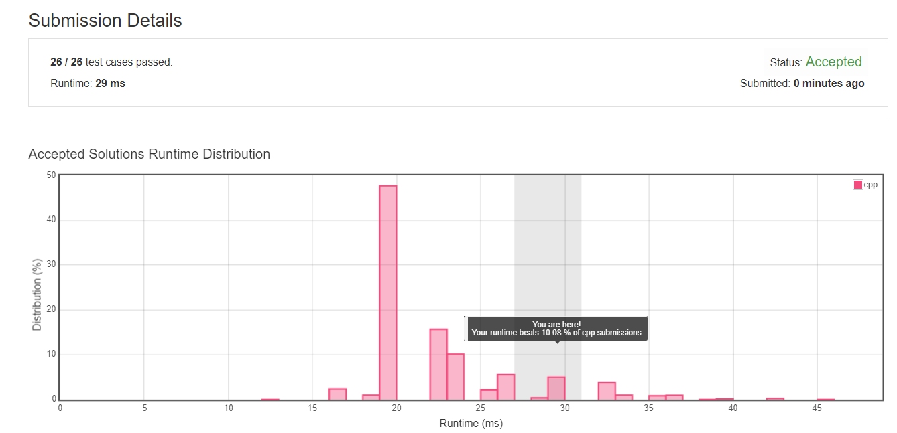

#   二叉树

##  Longest Univalue Path
Given a binary tree, find the length of the longest path where each node in the path has the same value. This path may or may not pass through the root.

Note: The length of path between two nodes is represented by the number of edges between them.

Example 1:
```
Input:

              5
             / \
            4   5
           / \   \
          1   1   5
```
Output:

2
Example 2:
```
Input:

              1
             / \
            4   5
           / \   \
          4   4   5
```
Output:

2
Note: The given binary tree has not more than 10000 nodes. The height of the tree is not more than 1000.

### C++
层次遍历二叉树结点, 依次搜索每个节点. 由于最长路径未必通过根节点, 因此需要即时计算最长路径并保存.


```cpp
/**
 * Definition for a binary tree node.
 * struct TreeNode {
 *     int val;
 *     TreeNode *left;
 *     TreeNode *right;
 *     TreeNode(int x) : val(x), left(NULL), right(NULL) {}
 * };
 */
 class Solution {
public:
    int longestUnivaluePath(TreeNode* root) {
        if (!root)
            return 0;
        int longestPath = 0;
        queue<TreeNode*> q;
        q.push(root);

        while (!q.empty())  {
            for (int i = 0; i < q.size(); i ++) {
                TreeNode* temp = q.front();
                q.pop();
                findPath(temp, temp -> val, longestPath);
                if (temp -> left)
                    q.push(temp -> left);
                
                if (temp -> right)
                    q.push(temp -> right);
            }
        }
        
        return longestPath;
        
    }

    int findPath (TreeNode* root, int val, int& longestPath)  {
        if (!root || root -> val != val)
            return 0
        
        int left = findPath(root -> left, val, longestPath);
        int right = findPath(root -> right, val, longestPath);
        
        if (left + right > longestPath)
            longestPath = left + right;
        
        return (left > right) ? left : right;
    }
};
```


##  Find Mode in Binary Search Tree
Given a binary search tree (BST) with duplicates, find all the mode(s) (the most frequently occurred element) in the given BST.

Assume a BST is defined as follows:

The left subtree of a node contains only nodes with keys less than or equal to the node's key.
The right subtree of a node contains only nodes with keys greater than or equal to the node's key.
Both the left and right subtrees must also be binary search trees.
For example:
Given BST [1,null,2,2],
```
   1
    \
     2
    /
   2
```
return [2].

Note: If a tree has more than one mode, you can return them in any order.

Follow up: Could you do that without using any extra space? (Assume that the implicit stack space incurred due to recursion does not count).

### Java

```java
/**
 * Definition for a binary tree node.
 * public class TreeNode {
 *     int val;
 *     TreeNode left;
 *     TreeNode right;
 *     TreeNode(int x) { val = x; }
 * }
 */
class Solution {
    public int[] findMode(TreeNode root) {
        Queue<TreeNode> q = new LinkedList<TreeNode>();
        HashMap<Integer, Integer> appearTimes = new HashMap<Integer, Integer>();
        int maxCount = 1;
        if (root == null)   {
            int[] result = new int[0];
            return result;
        }
        q.offer(root);

        while (!q.isEmpty())    {
            for (int i = 0; i < q.size(); i ++) {
                TreeNode temp = q.poll();
                if (!appearTimes.containsKey(temp.val)) {
                    appearTimes.put(temp.val, 1);
                } else {
                    int count = appearTimes.get(temp.val);
                    appearTimes.put(temp.val, count + 1);
                    if (count + 1 > maxCount)
                        maxCount = count + 1;
                }

                if (temp.left != null)
                    q.offer(temp.left);
                if (temp.right != null)
                    q.offer(temp.right);
            }
        }

        Queue<Integer> temp = new LinkedList<Integer>();
        for(HashMap.Entry<Integer, Integer> entry : appearTimes.entrySet())  {
            if (maxCount == entry.getValue())   {
                temp.offer(entry.getKey());
            }
        }

        int len = temp.size();
        int[] result = new int[len];

        for (int i = 0; i < len; i ++)  {
            result[i] = temp.poll();
        }

        return result;
    }
}
```
---

##  Balanced Binary Tree

Given a binary tree, determine if it is height-balanced.

For this problem, a height-balanced binary tree is defined as a binary tree in which the depth of the two subtrees of every node never differ by more than 1.

### Java
比较蠢的办法，递归求子树深度，并依次对每个节点做比较。

```java
/**
 * Definition for a binary tree node.
 * public class TreeNode {
 *     int val;
 *     TreeNode left;
 *     TreeNode right;
 *     TreeNode(int x) { val = x; }
 * }
 */
class Solution {
    public boolean isBalanced(TreeNode root) {
        if (root == null)  
            return true;
        
        int l = height(root.left);
        int r = height(root.right);

        if (l - r > 1 || r - l > 1) 
            return false;
        else
            return isBalanced(root.left) && isBalanced(root.right);
    }
    public int height (TreeNode root)   {
        if (root == null)   
            return 0;
        int l = height(root.left);
        int r = height(root.right);
        return 1 + (l > r ? l : r);
    }
}

```

##  Lowest Common Ancestor of a Binary Search Tree


### Java
题意就是寻找二叉树中高度最低的一个共同的父节点, 即从根节点开始的共同路径中的最后一个节点. 首先搜索两个节点, 路径存储在队列里, 然后找出最后一个相同节点即可.

```java
/**
 * Definition for a binary tree node.
 * public class TreeNode {
 *     int val;
 *     TreeNode left;
 *     TreeNode right;
 *     TreeNode(int x) { val = x; }
 * }
 */
class Solution {
    public TreeNode lowestCommonAncestor(TreeNode root, TreeNode p, TreeNode q) {
        Queue<TreeNode> q1 = new LinkedList<TreeNode>();
        Queue<TreeNode> q2 = new LinkedList<TreeNode>();

        q1.offer(root);
        q2.offer(root);

        TreeNode cur1 = root;
        while(cur1.val != p.val)    {
            cur1 = (p.val < cur1.val) ? cur1.left : cur1.right;
            q1.offer(cur1);
        }

        TreeNode cur2 = root;
        while(cur2.val != q.val)    {
            cur2 = (q.val < cur2.val) ? cur2.left : cur2.right;
            q2.offer(cur2);
        }
        TreeNode result = null;
        while (!q1.isEmpty() && !q2.isEmpty())  {
            TreeNode a = q1.poll(), b = q2.poll();
            if (a.val != b.val)
                break;
            else
                result = a;
        }

        return result;
    }
}
```

---

##  Path Sum III

### Java
从根节点开始遍历每个点, 依次搜索可能的路径. 需要注意的是, 类似1 2 和 1 2 -1 1这样的路径是计算为两次的.


```java
/**
 * Definition for a binary tree node.
 * public class TreeNode {
 *     int val;
 *     TreeNode left;
 *     TreeNode right;
 *     TreeNode(int x) { val = x; }
 * }
 */
class Solution {
    public int pathSum(TreeNode root, int sum) {
        if (root == null)
            return 0;
        Queue<TreeNode> queue = new LinkedList<TreeNode>();
        queue.offer(root);
        int result = 0;
        while (!queue.isEmpty())    {
            int size = queue.size();
            for (int i = 0; i < size; i ++) {
                TreeNode currentNode = queue.poll();
                result += searchPath(currentNode, sum);
                if (currentNode.left != null)
                    queue.offer(currentNode.left);
                if (currentNode.right != null)
                    queue.offer(currentNode.right);
            }
        }
        return result;
    }

    public int searchPath(TreeNode root, int sum)   {
        if (root == null)
            return 0;
        
        return (root.val == sum ? 1 : 0) + searchPath(root.left, sum - root.val) + searchPath(root.right, sum - root.val);
    }
}
```

##  Subtree of Another Tree 


### Java
倒是一次性写出了个bug free的代码，就是这执行时间...叹气


```java
/**
 * Definition for a binary tree node.
 * public class TreeNode {
 *     int val;
 *     TreeNode left;
 *     TreeNode right;
 *     TreeNode(int x) { val = x; }
 * }
 */
class Solution {
    public boolean isSubtree(TreeNode s, TreeNode t) {
        Queue<TreeNode> queue = new LinkedList<TreeNode>();
        queue.offer(s);

        while (!queue.isEmpty())    {
            int size = queue.size();
            for (int i = 0; i < size; i ++) {
                TreeNode currentNode = queue.poll();
                if (currentNode.val == t.val)   {
                    if (compareTree(currentNode, t))    {
                        return true;
                    }
                }
                if (currentNode.left != null)
                    queue.offer(currentNode.left);
                if (currentNode.right != null)
                    queue.offer(currentNode.right);
            }
        }
        return false;
    }

    public boolean compareTree(TreeNode a, TreeNode b)  {
        Queue<TreeNode> queueA = new LinkedList<TreeNode>();
        Queue<TreeNode> queueB = new LinkedList<TreeNode>();

        queueA.offer(a);
        queueB.offer(b);

        while (!queueA.isEmpty() && !queueB.isEmpty())  {
            int sizeA = queueA.size(), sizeB = queueB.size();
            if (sizeA != sizeB)
                return false;
            for (int i = 0; i < sizeA; i ++)    {
                TreeNode curA = queueA.poll(), curB = queueB.poll();
                if (curA.val != curB.val)
                    return false;
                if (curA.left != null)
                    queueA.offer(curA.left);
                if (curB.left != null)
                    queueB.offer(curB.left);
                if (curA.right != null)
                    queueA.offer(curA.right);
                if (curB.right != null)
                    queueB.offer(curB.right);
            }
        }
        return (queueA.isEmpty() && queueB.isEmpty());
    }
}

```

##  Binary Tree Level Order Traversal II


### Java

比较经典的一个算法。
队列中每次会包含二叉树同一层级的全部元素，在取出这一层的全部元素时，也把下一层的全部元素放进去，依次循环，直到队列为空，循环结束。
```java
/**
 * Definition for a binary tree node.
 * public class TreeNode {
 *     int val;
 *     TreeNode left;
 *     TreeNode right;
 *     TreeNode(int x) { val = x; }
 * }
 */
public class Solution {
    public List<List<Integer>> levelOrderBottom(TreeNode root) {
        List<List<Integer>> result = new ArrayList<>();
        if (root == null) {
            return result;
        }
        Queue<TreeNode> queue = new LinkedList<TreeNode>();
        queue.offer(root);
        
        while (!queue.isEmpty()) {
            int size = queue.size();
            List<Integer> level = new ArrayList<>();
            for (int i = 0; i < size; i++) {
                TreeNode head = queue.poll();
                level.add(head.val);
                if (head.left != null) {
                    queue.offer(head.left);
                }
                if (head.right != null) {
                    queue.offer(head.right);
                }
            }
            result.add(level);
        }
        
        Collections.reverse(result);
        return result;
    }
}
```


##  Second Minimum Node In a Binary Tree


### Java 


```java
/**
 * Definition for a binary tree node.
 * public class TreeNode {
 *     int val;
 *     TreeNode left;
 *     TreeNode right;
 *     TreeNode(int x) { val = x; }
 * }
 */
class Solution {
    public int findSecondMinimumValue(TreeNode root) {
        if (root == null || root.left == null)
            return -1;
        
        return find2ndMinValue(root);
    }
    public int find2ndMinValue(TreeNode root)  {
        if (root.left == null || root.right == null)
            return -1;

        int left = 0, right = 0;
        if (root.val == root.left.val && root.val == root.right.val)    {
            left = find2ndMinValue(root.left);
            right = find2ndMinValue(root.right);
        } else if (root.val == root.left.val && root.val != root.right.val) {
            left = find2ndMinValue(root.left);
            right = root.right.val;
        } else if (root.val != root.left.val && root.val == root.right.val) {
            left = root.left.val;
            right = right = find2ndMinValue(root.right);
        } else {
            return compare3Int(root.val, root.left.val, root.right.val);
        }

        if (left != -1 && right != -1)
            return compare3Int(root.val, left, right);
        if (left != -1)
            return root.val == left ? -1 : left;
        if (right != -1)
            return root.val == right ? -1 : right;
        return -1;
    }
    public int compare3Int(int a, int b, int c) {
        if (a == b)
            return c;
        if (a == c)
            return b;
        return b < c ? b : c;
    }
}
```


##  Convert Sorted Array to Binary Search Tree
Given an array where elements are sorted in ascending order, convert it to a height balanced BST.
### Java, 1ms @ 32 test cases
首先确定根节点的位置, 然后将原始数组以根节点的位置分割成两个数组, 对应左右两颗子树, 递归可得完整的树.
```java
/**
 * Definition for a binary tree node.
 * public class TreeNode {
 *     int val;
 *     TreeNode left;
 *     TreeNode right;
 *     TreeNode(int x) { val = x; }
 * }
 */
class Solution {
    public TreeNode sortedArrayToBST(int[] nums) {
        if (nums.length == 0)
            return null;
        return array2BST(nums, 0, nums.length - 1);
    }
    public TreeNode array2BST(int[] nums, int i, int j) {
        TreeNode newRoot = new TreeNode(0);
        //  only one element
        if (i == j) {
            newRoot.val = nums[i];
            return newRoot;
        }

        if (i + 1 == j) {
            newRoot.val = nums[i];
            newRoot.right = new TreeNode(nums[j]);
            return newRoot;
        }

        int midIndex = (i + j + 1) / 2;
        newRoot.val = nums[midIndex];
        newRoot.left = array2BST(nums, i, midIndex - 1);
        newRoot.right = array2BST(nums, midIndex + 1, j);
        return newRoot;
    }
}
```


##  Diameter of Binary Tree


### Java, 12ms @ 106 test cases
递归遍历二叉树, 计算每个根节点左右子树中的最长路径, 并计算当前根节点的左右子树的最长路径之和, 保留最大值. 需要注意的是, 最长路径未必经过根节点, 比如下面这种情况:


<center></center>

```java
/**
 * Definition for a binary tree node.
 * public class TreeNode {
 *     int val;
 *     TreeNode left;
 *     TreeNode right;
 *     TreeNode(int x) { val = x; }
 * }
 */
class Solution {
    public int result = 0;
    public int diameterOfBinaryTree(TreeNode root) {
        if (root == null)
            return 0;
        findLeaves(root);
        return result;
    }
    public int findLeaves(TreeNode root)    {
        if (root == null)
            return 0;
        if (root.left == null && root.right == null)
            return 1;
        int left = 0; 
        int right = 0;

        left = findLeaves(root.left);
        right = findLeaves(root.right);
        
        if (left + right > result) {
            result = left + right;
        }
        return (left > right) ? (left + 1) : (right + 1);
            
    }
}
```
---
##  Trim a Binary Search Tree


### Algorithm0: 9ms, 77 test cases, Java
*   根节点比L小, 则抛弃左枝, 修建右枝.
*   根节点比R大, 则抛弃右枝, 修建左枝.
*   根节点在L和R中间, 则分别修剪左右枝.

```java
/**
 * Definition for a binary tree node.
 * public class TreeNode {
 *     int val;
 *     TreeNode left;
 *     TreeNode right;
 *     TreeNode(int x) { val = x; }
 * }
 */
class Solution {
    public TreeNode trimBST(TreeNode root, int L, int R) {
        if (root == null) 
            return null;
        
        if (root.val >= L && root.val <= R) {
            root.left = trimBST(root.left, L, R);
            root.right = trimBST(root.right, L, R);
            return root;
        }
        
        if(root.val < L)  
            return trimBST(root.right, L, R);
        
        return trimBST(root.left, L, R);
    }
}
```
---


##  Binary Tree Tilt

Given a binary tree, return the tilt of the whole tree.

The tilt of a tree node is defined as the absolute difference between the sum of all left subtree node values and the sum of all right subtree node values. Null node has tilt 0.

The tilt of the whole tree is defined as the sum of all nodes' tilt.
```
Example:
Input: 
         1
       /   \
      2     3
Output: 1
Explanation: 
Tilt of node 2 : 0
Tilt of node 3 : 0
Tilt of node 1 : |2-3| = 1
Tilt of binary tree : 0 + 0 + 1 = 1
```

Note:

The sum of node values in any subtree won't exceed the range of 32-bit integer.
All the tilt values won't exceed the range of 32-bit integer.


### Algorithm0 : 8ms @ 75 test cases
注意审题, 题目求的是每个节点的tilt之和, 每个节点的tilt是它的左右子树的和的差的绝对值.

```java
/**
 * Definition for a binary tree node.
 * public class TreeNode {
 *     int val;
 *     TreeNode left;
 *     TreeNode right;
 *     TreeNode(int x) { val = x; }
 * }
 */        
public class Solution {
    private int sum = 0;  
    public int findTilt(TreeNode root) {  
        sum(root);  
        return sum;  
    }  
    private int helper(TreeNode root) {  
        if (root == null)  
            return 0;  
        int left = helper(root.left);  
        int right = helper(root.right);  
        sum += Math.abs(left - right);  
        return root.val + left + right;  
    }  
}
```

---


##  Minimum Absolute Difference in BST

Given a binary search tree with non-negative values, find the minimum absolute difference between values of any two nodes.
```
Example:

Input:

   1
    \
     3
    /
   2

Output:
1

Explanation:
The minimum absolute difference is 1, which is the difference between 2 and 1 (or between 2 and 3).
```
Note: There are at least two nodes in this BST.

### Algorithm0 : 49ms @ 186 test cases.
中序遍历, pre变量记录上一个遍历到的值, 并作比较. 


```c++
/**
 * Definition for a binary tree node.
 * struct TreeNode {
 *     int val;
 *     TreeNode *left;
 *     TreeNode *right;
 *     TreeNode(int x) : val(x), left(NULL), right(NULL) {}
 * };
 */
class Solution {
public:
    int getMinimumDifference(TreeNode* root) {
        int minDiff = INT_MAX;
        int pre = -1;
        
        convert(root, pre, minDiff);
        return minDiff;
    }
    void convert(TreeNode* root, int& pre, int& minDiff)  {
        if (root == NULL) return;
        
        convert(root -> left, pre, minDiff);
        if (pre != -1)
            minDiff = min(minDiff, root -> val - pre);
        pre = root -> val;
            
        cout << root -> val << endl;
        convert(root -> right, pre, minDiff);   
    }    
};
```

---

##  Convert BST to Greater Tree
Given a Binary Search Tree (BST), convert it to a Greater Tree such that every key of the original BST is changed to the original key plus sum of all keys greater than the original key in BST.

```
Example:

Input: The root of a Binary Search Tree like this:
              5
            /   \
           2     13

Output: The root of a Greater Tree like this:
             18
            /   \
          20     13
```
### Algorithm0 : 39ms @ 212 test cases
二叉树中序遍历, 先遍历右侧子树, 再遍历左侧子树.

```c++
/**
 * Definition for a binary tree node.
 * struct TreeNode {
 *     int val;
 *     TreeNode *left;
 *     TreeNode *right;
 *     TreeNode(int x) : val(x), left(NULL), right(NULL) {}
 * };
 */
class Solution {
public:
    void convert(TreeNode* root, int& sum)  {
        if (root == NULL) return;
        convert(root -> right, sum);
        root -> val += sum;
        sum = root -> val;
        convert(root -> left, sum);
    }
    TreeNode* convertBST(TreeNode* root) {
        int sum = 0;
        convert(root, sum);
        return root;
    }
};
```


---


##  Two Sum IV - Input is a BST
Given a Binary Search Tree and a target number, return true if there exist two elements in the BST such that their sum is equal to the given target.

```
Example: 
Input: 
    5
   / \
  3   6
 / \   \
2   4   7

Target = 9

Output: True
```

### Algorithm0 : 56ms @ 421 test cases.
用递归的方式遍历该二叉树, 每一个节点存入map里, 并搜索之前的结果中是否存在配对.
这样的解法必然不是最快的, 因为完全没有用到BST本身的性质.

```c++
/**
 * Definition for a binary tree node.
 * struct TreeNode {
 *     int val;
 *     TreeNode *left;
 *     TreeNode *right;
 *     TreeNode(int x) : val(x), left(NULL), right(NULL) {}
 * };
 */
class Solution {
public:
    // map<int,int> *pMap
    bool bstErgodic(map<int,int> *bst, TreeNode* root, int k) {
        if (!root)
            return false;

        map<int, int>::iterator it;
        it = (*bst).find(k - root -> val);
        if (it == (*bst).end()) {
            (*bst)[root -> val] = 1;
            return bstErgodic(bst, root -> left, k) || bstErgodic(bst, root -> right, k);
        } else {
            return true;
        }
        
    };
    bool findTarget(TreeNode* root, int k) {
        map<int, int> bstMap;
        return bstErgodic(&bstMap, root, k);
    };
    

};
```


## Merge two binary trees

Given two binary trees and imagine that when you put one of them to cover the other, some nodes of the two trees are overlapped while the others are not.

You need to merge them into a new binary tree. The merge rule is that if two nodes overlap, then sum node values up as the new value of the merged node. Otherwise, the NOT null node will be used as the node of new tree.
### 思路

递归，对每个节点分别合并左右子树。只要有一侧还有叶子节点，就应继续做合并操作。

```c++
/**
 * Definition for a binary tree node.
 * struct TreeNode {
 *     int val;
 *     TreeNode *left;
 *     TreeNode *right;
 *     TreeNode(int x) : val(x), left(NULL), right(NULL) {}
 * };
 */
class Solution {
public:
    TreeNode* mergeTrees(TreeNode* t1, TreeNode* t2) {
        
        if (!t1 && !t2) {
            return NULL;
        }
        
        TreeNode* t3 = new TreeNode(0);
        if (t1 && t2)   {
            t3 -> val = t1 -> val + t2 -> val;
        } else {
            t3 -> val = t1 ? t1 -> val : t2 -> val;
        }
            
        t3 -> left = mergeTrees(t1 ? t1 -> left : NULL, t2 ? t2 -> left : NULL);
        t3 -> right = mergeTrees(t1 ? t1 -> right : NULL, t2 ? t2 -> right : NULL);
        return t3;
    }
};
```

---


##    Average_of_levels_in_binary_tree
Given a non-empty binary tree, return the average value of the nodes on each level in the form of an array.
###  Analysis
二叉树的层次遍历。利用队列实现，每次计算本层次的全部节点的平均值，并在计算平均值的时候将下一层次的节点压入队列中。
###  Algorithm0: 13ms @ 64test cases
```c++
/**
 * Definition for a binary tree node.
 * struct TreeNode {
 *     int val;
 *     TreeNode *left;
 *     TreeNode *right;
 *     TreeNode(int x) : val(x), left(NULL), right(NULL) {}
 * };
 */
class Solution {
public:
    vector<double> averageOfLevels(TreeNode* root) {
        vector<double> res;
        double avg = 0;
        queue<TreeNode*> q;
        q.push(root);
        while (!q.empty()) {
            int n = q.size();
            double sum = 0;
            for (int i = 0; i != n; i++) {
                TreeNode* node = q.front();
                q.pop();
                sum += node->val;
                if (node->left != nullptr)
                    q.push(node->left);
                if (node->right != nullptr)
                    q.push(node->right);
            }
            avg = sum / n;
            res.push_back(avg);
        }
        return res;
    }
};
```

---

##  Construct String from Binary Tree

You need to construct a string consists of parenthesis and integers from a binary tree with the preorder traversing way.

The null node needs to be represented by empty parenthesis pair "()". And you need to omit all the empty parenthesis pairs that don't affect the one-to-one mapping relationship between the string and the original binary tree.

**Example:**
Input: Binary tree: ``[1,2,3,null,4]``
```
       1
     /   \
    2     3
     \  
      4 
```
The original output: "1(2()(4))(3()())"
After removing the empty parenthesis pair, the output is : "1(2()(4))(3)"

### 思路
规则比较多, 整理一下
*   右侧叶子节点为空, 左侧叶子节点不为空时, 右侧的叶子节点的()可忽略.
*   左侧叶子节点为空, 右侧叶子节点不为空时, 左侧的叶子节点的()不可忽略.
*   没有叶子节点, 直接返回该数值本身.

抓住以上几个规则, 用递归实现还是很容易的. 

### C++ : 12ms @ 162 test cases
```c++
/**
 * Definition for a binary tree node.
 * struct TreeNode {
 *     int val;
 *     TreeNode *left;
 *     TreeNode *right;
 *     TreeNode(int x) : val(x), left(NULL), right(NULL) {}
 * };
 */
class Solution {
public:
    string tree2str(TreeNode* t) {
        if (!t)
            return "";
        
        if (!t -> left && !t -> right)
            return to_string(t -> val);
        if (!t -> left && t -> right)
            return to_string(t -> val) + "()(" + tree2str(t -> right) + ")";
        if (t -> left && !t -> right)
            return to_string(t -> val) + "(" + tree2str(t -> left) + ")";
        return to_string(t -> val) + "(" + tree2str(t -> left) + ")(" + tree2str(t -> right) + ")";
    }
};
```

#   链表
##  Palindrome Linked List
Given a singly linked list, determine if it is a palindrome.

Follow up:
Could you do it in O(n) time and O(1) space?

### C++
暂时先没想到o(n)时间和o(1)空间的解法, 先写个o(n)/o(n)的吧


```cpp
/**
 * Definition for singly-linked list.
 * struct ListNode {
 *     int val;
 *     ListNode *next;
 *     ListNode(int x) : val(x), next(NULL) {}
 * };
 */
class Solution {
public:
    bool isPalindrome(ListNode* head) {
        stack<int> s;
        ListNode* slow = head;
        ListNode* fast = head;

        if (!head || !(head -> next))
            return true;

        while (fast && fast -> next)    {
            s.push(slow -> val);
            slow = slow -> next;
            fast = fast -> next -> next;
        }

        if (fast)   {
            slow = slow -> next;    //  Ignore this middle value.
        }

        while (slow)    {
            if (slow -> val != s.top()) {
                return false;
            }
            s.pop();
            slow = slow -> next;
        }

        return true;
    }
};
```

---

##  Merge Two Sorted Lists 
Merge two sorted linked lists and return it as a new list. The new list should be made by splicing together the nodes of the first two lists.

### Java
经典链表题了.

```java

 /**
 * Definition for singly-linked list.
 * public class ListNode {
 *     int val;
 *     ListNode next;
 *     ListNode(int x) { val = x; }
 * }
 */
class Solution {
    public ListNode mergeTwoLists(ListNode l1, ListNode l2) {  
        ListNode result = new ListNode(0);  
        ListNode pre = result;  
        result.next = l1;  
        while (l1 != null && l2 != null)    {
            if (l1.val > l2.val)    {
                ListNode temp = l2.next;
                l2.next = l1;
                pre.next = l2;
                l2 = temp;
            } else {
                l1 = l1.next;
            }
            pre = pre.next;
        }
        if  (l2 != null)    {  
            pre.next = l2;  
        }  
        return result.next;  
    }   
}

```

##  Delete node in a linked list
```c++
//  唯一的参数就是要删除的节点
//  题设确保了不会是尾部节点（否则上一个节点的指针没法置空）
//  单向链表是没法逆序回去的，所以只能用下一个节点的值替换这个节点，然后删除下个节点。

/**
 * Definition for singly-linked list.
 * struct ListNode {
 *     int val;
 *     ListNode *next;
 *     ListNode(int x) : val(x), next(NULL) {}
 * };
 */
class Solution {
public:
    void deleteNode(ListNode* node) {
        ListNode* nextNode = node -> next;
        node -> val = nextNode -> val;
        node -> next = nextNode -> next;
        delete nextNode;
        return;
    }
};
```

#   其他

##  Largest Palindrome Product
Find the largest palindrome made from the product of two n-digit numbers.

Since the result could be very large, you should return the largest palindrome mod 1337.

Example:

Input: 2

Output: 987

Explanation: 99 x 91 = 9009, 9009 % 1337 = 987

Note:

The range of n is [1,8].

### C++
这题老实说实在没什么价值，因为最快的实现肯定是查表。硬算的话，没有特别简洁的算法。
看了下时间，明显的两极分化，左边那一小撮的肯定是查表做的，中间一大撮的应该是直接算的。
```cpp
class Solution {
public:
    int largestPalindrome(int n) {
        long int result[8] = {9, 9009, 906609, 99000099, 9966006699, 999000000999, 99956644665999, 9999000000009999};
        return result[n - 1] % 1337;
    }
};
```


---

##  Non decreasing array
 Given an array with n integers, your task is to check if it could become non-decreasing by modifying at most 1 element.

We define an array is non-decreasing if ``array[i] <= array[i + 1]`` holds for every i (1 <= i < n).

Example 1:
```
Input: [4,2,3]
Output: True
Explanation: You could modify the first 
4
 to 
1
 to get a non-decreasing array.
 ```

Example 2:
```
Input: [4,2,1]
Output: False
Explanation: You can't get a non-decreasing array by modify at most one element.
```

### c++

```cpp
class Solution {
public:
    bool checkPossibility(vector<int>& nums) {
        int len = nums.size();
        bool invertFlag = false;
        if (len == 1)
            return true;
        for (int i = 0; i < len-1; i ++)    {
            int left = (i-1 >= 0) ? nums[i-1] : 0, right = nums[i+1];
            if (nums[i] > right)    {
                if (invertFlag) 
                    return false;
                else {
                    invertFlag = true;
                    if (left > right )  {
                        nums[i+1] = nums[i];
                    } else {
                        nums[i] = left;
                    }
                }
            }
        }
        return true;
    }
};
```

##  Rotate Arrays
Rotate an array of n elements to the right by k steps.

For example, with n = 7 and k = 3, the array ``[1,2,3,4,5,6,7]`` is rotated to ``[5,6,7,1,2,3,4]``.

Note:
Try to come up as many solutions as you can, there are at least 3 different ways to solve this problem.

### C++
这是基础解法，使用了o(n)的辅助数组。难点在于如何使用o(1)的空间。
```cpp
class Solution {
public:
    void rotate(vector<int>& nums, int k) {
        vector<int> nums2;
        if (k == 0)
            return;
        int start = (k >= nums.size()) ? (k % nums.size()) : k;
        for (int i = 0; i < nums.size(); i ++)  {
            nums2.push_back(nums[i]);
        }
        for (int i = 0; i < nums.size(); i ++)  {
            // cout << i << '\t' << start << '\t' << nums2[start] << endl;
            nums[start] = nums2[i];
            if (++start == nums.size())
                start = 0;
        }
        return;
    }
};
```

##  Valid Palindrome
Given a string, determine if it is a palindrome, considering only alphanumeric characters and ignoring cases.

For example,
``"A man, a plan, a canal: Panama"`` is a palindrome.
``"race a car"`` is **not** a palindrome.

### C++
头尾同时遍历, 向中间靠拢. 遇到非字母数字的字符跳过. 

```cpp
class Solution {
public:
    bool isPalindrome(string s) {
        int len = s.size();
        if (len == 0)
            return true;
        for (int i = 0, j = len - 1; i <= j; i ++, j --) {
            while (checkValidAlphabet(s[i]) == -1)   {
                i ++;
            }

            while (checkValidAlphabet(s[j]) == -1)   {
                j --;
            }
            if (i <= j) {
                if (checkValidAlphabet(s[i]) != checkValidAlphabet(s[j]))
                    return false;
            } else {
                break;
            }
        }
        return true;
    }
    int checkValidAlphabet(char a)  {
        if (a >= 'A' && a <= 'Z')   {
            return a - 'A' + 'a';
        } else if (a >= 'a' && a <= 'z')    {
            return a;
        } else if (a >= '0' && a <= '9')    {
            return a;
        } else {
            return -1;
        }
    }
}; 
```

---

##  Count Primes

Count the number of prime numbers less than a non-negative number, n.

### C++
这题我是参考了[这个解法](http://www.cnblogs.com/grandyang/p/4462810.html)来做的.
首先, 如果一个数字是非质数的话, 那么它的因数再遍历过程中必然呈现对称分布. 如8 = 2x4 = 4x2. 因此我们只需要遍历2~sqrt(8)的部分就可以了. 对于n来说, 遍历的边界为sqrt(n). 因此对于小于n的所有数, 遍历的边界都不会超过这个数字.

然后, 从2开始, 对每个之前遍历中未被标记过的元素的倍数进行标记, 被标记过的元素即为非质数. 但不标记其本身. 这里隐含了一个证明, 那就是这个在之前遍历中未被标记的元素是质数.

最后, 遍历整个结果, 统计未被标记的元素的个数.


```cpp
class Solution {
public:
    int countPrimes(int n) {
        int cnt = 0, limit = sqrt(n);
        vector<bool> num(n-1, false);
        num[0] = true;
        for (int i = 2; i <= limit; i ++)   {
            if (!num[i-1])  {
                for (int j = i * 2; j < n; j += i)  {
                    num[j-1] = true;
                }
            }
        }
        
        for (int j = 0; j < n - 1; ++j) {
            if (!num[j]) 
                cnt ++;
        }
        return cnt;
    }
};
```

---

##  Excel Sheet Column Title
Given a positive integer, return its corresponding column title as appear in an Excel sheet.

For example:
```
    1 -> A
    2 -> B
    3 -> C
    ...
    26 -> Z
    27 -> AA
    28 -> AB 
```

### C++
这题跟26进制转换很类似, 但又不完全一样. 首先循环从A开始, 暗示A代表26进制中的0. 但是进位之后的数字也从A开始计, 这个规律按照十进制记数法表示就是0, 1, 2, ..., 9, 00, 01 这样.

按照这个规律, 二位数字中会平白无故多出10个数, 00~09. 三位数字中会多出100个数, 000~099. 所以, 每一次循环都要对n减一处理, 将多出来的数字去掉.

```cpp
class Solution {
public:
    string convertToTitle(int n) {
        string s = "";
        while (n != 0)  {
            n --;
            s = int2Alphabet(n % 26) + s;
            n /= 26;
        }

        return s;
    }
    char int2Alphabet(int n)    {
        return 'A' + n;
    }
};

```


---

##  Third Maximum Number
Given a non-empty array of integers, return the third maximum number in this array. If it does not exist, return the maximum number. The time complexity must be in O(n).

Example 1:
Input: [3, 2, 1]

Output: 1

Explanation: The third maximum is 1.
Example 2:
Input: [1, 2]

Output: 2

Explanation: The third maximum does not exist, so the maximum (2) is returned instead.
Example 3:
Input: [2, 2, 3, 1]

Output: 1

Explanation: Note that the third maximum here means the third maximum distinct number.
Both numbers with value 2 are both considered as second maximum.

### C++

```cpp
class Solution {
public:
    int thirdMax(vector<int>& nums) {
        int len = nums.size();
        std::sort(nums.begin(), nums.end());
        int cnt = 0;
        map<int, int> temp;
        for (int i = len - 1; i >= 0; i --) {
            if (temp.count(nums[i]) == 0)   {
                temp[nums[i]] = 1;
                if (++cnt == 3)
                    return nums[i];
            }
        }
        return nums[len - 1];
    }
};
```

---

##  Sqrt(x)
Implement int sqrt(int x).

Compute and return the square root of x.

x is guaranteed to be a non-negative integer.

### C++
这个算法代码很简洁, 但是效率太差, 执行sqrt(x)次.

```cpp
class Solution {
public:
    int mySqrt(int x) {
        int i;
        for (i = 1; i <= x/i; i ++)  {
            if (x == i * i)
                return i;
        }
        return i - 1;
    }
};
```


##  K-diff Pairs in an Array
Given an array of integers and an integer k, you need to find the number of unique k-diff pairs in the array. Here a k-diff pair is defined as an integer pair (i, j), where i and j are both numbers in the array and their absolute difference is k.

Example 1:
```
Input: [3, 1, 4, 1, 5], k = 2
Output: 2
Explanation: There are two 2-diff pairs in the array, (1, 3) and (3, 5).
Although we have two 1s in the input, we should only return the number of unique pairs.
```
Example 2:
```
Input:[1, 2, 3, 4, 5], k = 1
Output: 4
Explanation: There are four 1-diff pairs in the array, (1, 2), (2, 3), (3, 4) and (4, 5).
```
Example 3:
```
Input: [1, 3, 1, 5, 4], k = 0
Output: 1
Explanation: There is one 0-diff pair in the array, (1, 1).
```
Note:
*   The pairs (i, j) and (j, i) count as the same pair.
*   The length of the array won't exceed 10,000.
*   All the integers in the given input belong to the range: [-1e7, 1e7].

### C++错误解
这个解法存在一个问题, 单向映射可能会存在多个解, 如对同一个元素2, k=1, 那么1, 3都满足条件. 此时如果先出现(2,3)再出现(2,1), 此时map中保存的东西会被更新成(2,1). 后续再出现(2,3)时仍能通过去重检验, 这就是问题所在.
```cpp
class Solution {
public:
    int findPairs(vector<int>& nums, int k) {
        map<int, int> pairs;
        int cnt = 0;
        if (k < 0)
            return 0;

        for (int i = 0; i < nums.size(); i ++)  {
            int a = nums[i] + k, b = nums[i] - k;
            for (int j = i + 1; j < nums.size(); j ++)  {
                if (nums[j] == a || nums[j] == b)   {
                    if ((pairs.count(nums[i]) == 0 || pairs[nums[i]] != nums[j]) && (pairs.count(nums[j]) == 0 || pairs[nums[j]] != nums[i])) {
                        pairs[nums[i]] = nums[j];
                        pairs[nums[j]] = nums[i];
                        cnt ++;
                    }
                }
            }
        }
        return cnt;
    }
};
```

### C++

```cpp
class Solution {
public:
    int findPairs(vector<int>& nums, int k) {
        int cnt = 0, n = nums.size();
        map<int, int> m;
        for (int num : nums) 
            m[num] ++;
        for (auto number : m) {
            if (k == 0 && number.second > 1)
                cnt ++;
            if (k > 0 && m.count(number.first + k)) 
                cnt ++;
        }
        return cnt;
    }
};
```
---
##  Implement strStr()
Implement strStr().

Return the index of the first occurrence of needle in haystack, or -1 if needle is not part of haystack.

Example 1:

Input: haystack = "hello", needle = "ll"
Output: 2
Example 2:

Input: haystack = "aaaaa", needle = "bba"
Output: -1


### C++
从haystack字符串头开始遍历, 依次和needle的第一个字符比较, 如果相等再开始比较剩下的字符.


```cpp
class Solution {
public:
    int strStr(string haystack, string needle) {
        int lenH = haystack.size(), lenN = needle.size();
        if (lenN == 0)
            return 0;
        if (lenH < lenN)
            return -1;
        for (int i = 0; i <= lenH - lenN; i ++)  {
            if (haystack[i] == needle[0])   {
                cout << i << endl;
                for (int j = 0; j < lenN; j ++) {
                    if (haystack[i+j] != needle[j])
                        break;
                    if (j+1 == lenN)
                        return i;
                }
            }
        }
        return -1;
    }
};
```

---
##  Shortest Unsorted Continuous Subarray

Given an integer array, you need to find one continuous subarray that if you only sort this subarray in ascending order, then the whole array will be sorted in ascending order, too.

You need to find the shortest such subarray and output its length.

Example 1:
```
Input: [2, 6, 4, 8, 10, 9, 15]
Output: 5
Explanation: You need to sort [6, 4, 8, 10, 9] in ascending order to make the whole array sorted in ascending order.
```

Note:
Then length of the input array is in range [1, 10,000].
The input array may contain duplicates, so ascending order here means <=.

### C++

```cpp
class Solution {
public:
    int findUnsortedSubarray(vector<int>& nums) {
        vector<int> temp = nums;
        std::sort(nums.begin(), nums.end()); 
        
        int i = 0, j = nums.size() - 1;
        while (i < nums.size() && temp[i] == nums[i])  {
            i ++;
        }
        if (i == nums.size())
            return 0;
        
        while (temp[j] == nums[j])  {
            j --;
        }
        
        return j - i + 1;
        
    }
};
```

---

##  Reverse Bits
Reverse bits of a given 32 bits unsigned integer.

For example, given input 43261596 (represented in binary as ``00000010100101000001111010011100``), return 964176192 (represented in binary as ``00111001011110000010100101000000``).

Follow up:
If this function is called many times, how would you optimize it?

### C++
把n最高位的数字取出来, 赋值到结果的最高位, 再依次右移. 循环结束时, 原来的最高位就变换到了最低位.

```cpp
class Solution {
public:
    uint32_t reverseBits(uint32_t n) {
        uint32_t result = 0;
        for (int i = 0; i < 32; i ++)   {
            result = result >> 1;
            uint32_t bit = n & 0x80000000;
            if (bit != 0)   {
                result |= 0x80000000;
            }
            n = n << 1;
        }
        return result;
    }
};
```

---

##  Heaters
Winter is coming! Your first job during the contest is to design a standard heater with fixed warm radius to warm all the houses.

Now, you are given positions of houses and heaters on a horizontal line, find out minimum radius of heaters so that all houses could be covered by those heaters.

So, your input will be the positions of houses and heaters seperately, and your expected output will be the minimum radius standard of heaters.

Note:
Numbers of houses and heaters you are given are non-negative and will not exceed 25000.
Positions of houses and heaters you are given are non-negative and will not exceed 10^9.
As long as a house is in the heaters' warm radius range, it can be warmed.
All the heaters follow your radius standard and the warm radius will the same.
Example 1:
```
Input: [1,2,3],[2]
Output: 1
Explanation: The only heater was placed in the position 2, and if we use the radius 1 standard, then all the houses can be warmed.
```
Example 2:
```
Input: [1,2,3,4],[1,4]
Output: 1
Explanation: The two heater was placed in the position 1 and 4. We need to use radius 1 standard, then all the houses can be warmed.
```

### C++

```cpp
class Solution {
public:
    int findRadius(vector<int>& houses, vector<int>& heaters) {
        int res = 0;
        sort(heaters.begin(), heaters.end());
        for (int house : houses) {
            auto pos = lower_bound(heaters.begin(), heaters.end(), house);
            int dist1 = (pos == heaters.end()) ? INT_MAX : *pos - house;
            int dist2 = (pos == heaters.begin()) ? INT_MAX : house - *(--pos);
            res = max(res, min(dist1, dist2));
        }
        return res;
    }
};
```

##  MinStack
Design a stack that supports push, pop, top, and retrieving the minimum element in constant time.

push(x) -- Push element x onto stack.
pop() -- Removes the element on top of the stack.
top() -- Get the top element.
getMin() -- Retrieve the minimum element in the stack.
Example:
```
MinStack minStack = new MinStack();
minStack.push(-2);
minStack.push(0);
minStack.push(-3);
minStack.getMin();   --> Returns -3.
minStack.pop();
minStack.top();      --> Returns 0.
minStack.getMin();   --> Returns -2.
```

### C++
用另外一个栈来记录此栈的最小值. 核心问题其实就是, 最小值的准确性. 会不会存在s2栈已经空了, 但是s1栈里还有元素, 也就是此时最小值函数失效呢? 分两种情况. 关注第一个入栈的元素.
*   如果第一个入栈的元素比之后的所有元素都小, 那么该元素将一直再s1和s2的栈底部, 直到其他元素都pop掉之后, 才会pop.
*   如果后续有比首个元素小的值, 那么s2中会压入新的元素. 出栈时也是先pop掉前面的最小值.


```cpp
class MinStack {
public:
    /** initialize your data structure here. */
    MinStack() {}
    
    void push(int x) {
        s1.push(x);
        if (s2.empty() || x <= s2.top()) s2.push(x);
    }
    
    void pop() {
        if (s1.top() == s2.top()) 
            s2.pop();
        s1.pop();
    }
    
    int top() {
        return s1.top();
    }
    
    int getMin() {
        return s2.top();
    }
    
private:
    stack<int> s1, s2;
};

/**
 * Your MinStack object will be instantiated and called as such:
 * MinStack obj = new MinStack();
 * obj.push(x);
 * obj.pop();
 * int param_3 = obj.top();
 * int param_4 = obj.getMin();
 */
```

---

##  Can Place Flowers

### C++
可以种花的位置无非三种情况:
*   头部两个0
*   中间三个0
*   尾部两个0

另外, 找到种花位置后, 下一个位置可以直接跳过不判断; 对于1的位置, 也可以跳过下一个位置不判断.

```cpp
class Solution {
public:
    bool canPlaceFlowers(vector<int>& flowerbed, int n) {
        int sum = 0;
        for (int i = 0; i < flowerbed.size(); i ++) {
            if (flowerbed[i] == 0)  {
                if ((i==0 && flowerbed[1] == 0) || (i+1 == flowerbed.size() && flowerbed[i-1] == 0) || (flowerbed[i-1] == 0 && flowerbed[i+1] == 0))    {
                    sum ++;
                    i ++;
                    if (sum >= n)
                        return true;
                }
            } else {
                i++;
            }
        }
        return (sum >= n);
    }
};
```

---

##  Range Sum Query - Immutable
Given an integer array nums, find the sum of the elements between indices i and j (i ≤ j), inclusive.

Example:
```
Given nums = [-2, 0, 3, -5, 2, -1]

sumRange(0, 2) -> 1
sumRange(2, 5) -> -1
sumRange(0, 5) -> -3
```
Note:
You may assume that the array does not change.
There are many calls to sumRange function.

### C++
这题蛮无语的, 看了半天没懂要干啥. 无非就是把累加循环求和的运算用空间换时间的策略简化了一下. 还有这种操作?

```cpp
class NumArray {
public:
    NumArray(vector<int> nums) {
        sum = nums;
        for (int i = 1; i < nums.size(); i ++)  {
            sum += sum[i - 1];
        }
    }
    
    int sumRange(int i, int j) {
        return i == 0? sum[j] : sum[j] - sum[i - 1];
    }
private:
    vector<int> sum;
};

/**
 * Your NumArray object will be instantiated and called as such:
 * NumArray obj = new NumArray(nums);
 * int param_1 = obj.sumRange(i,j);
 */

```

##  Repeated String Match

### C++
因为B要是A重复之后的一个子串, 首先构造str并不断重复A使得str的长度刚好达到或者超过B. 然后检查是否B是子串, 如果不是, 再重复添加一次A, 再检查一次. 如果还不是, 那就没可能了. 因为如果B是截取的A尾部和头部部分字符串拼凑的话, 重复一次A必然会搜索到B.


```cpp
class Solution {
public:
    int repeatedStringMatch(string A, string B) {
        int count = 0;
        string str;

        while (str.size() < B.size())   {
            str.append(A);
            count ++;
        }

        if (str.find(B) != -1)  {
            return count;
        }

        str.append(A);
        if (str.find(B) != -1)  {
            return ++count;
        }

        return -1;
    }
};
```

---

##  Valid Palindrome II

Given a non-empty string s, you may delete at most one character. Judge whether you can make it a palindrome.

Example 1:
```
Input: "aba"
Output: True
```
Example 2:

```
Input: "abca"
Output: True
Explanation: You could delete the character 'c'.
```
Note:
The string will only contain lowercase characters a-z. The maximum length of the string is 50000.

### C++
双支针, 向中间靠拢. 遇到不同的字符时则尝试跳过, 可以左侧跳过也可以右侧跳过. 当两侧跳过都满足条件时, 则需要再多判断下一个字符的情况.


```cpp
class Solution {
public:
    bool validPalindrome(string s) {
        int len = s.size();
        int i = 0, j = len - 1;
        bool jumpFlag = false;
        while (i <= j)  {
            if (s[i] != s[j])   {
                if (jumpFlag)
                    return false;
                
                if (i+1 <= j && s[i+1] == s[j] && s[i] == s[j-1])   {
                    if (i+2 > j-1)  {
                        i ++;
                    } else {
                        if (s[i+2] == s[j-1])   {
                            i ++;
                            jumpFlag = true;
                        } else if (s[i+1] == s[j-2])    {
                            j --;
                            jumpFlag = true;
                        } else {
                            return false;
                        }
                    }
                } else {
                    if (i+1 <= j && s[i+1] == s[j] ) {
                        i ++;
                        jumpFlag = true;
                    } else if (i <= j-1 && s[i] == s[j-1]) {
                        j --;
                        jumpFlag = true;
                    }

                }

                if (s[i] != s[j])   {
                    return false;   
                }   
            }
            i ++;
            j --;
        }
        return true;
    }
};
```

##  Sum of Square Numbers
Given a non-negative integer c, your task is to decide whether there're two integers a and b such that a2 + b2 = c.

Example 1:
Input: 5
Output: True
Explanation: 1 * 1 + 2 * 2 = 5
Example 2:
Input: 3
Output: False

### C++
太多乘法和开方运算了, 影响效率


```cpp
class Solution {
public:
    bool judgeSquareSum(int c) {
        int bound = floor(sqrt(0.5 * c));
        for (int i = bound; i >= 0; i --)    {
            double root = sqrt(c - i * i);
            if (round(root) * round(root) + i * i == c)
                return true;
        }

        return false;
    }
};
```

---
##  Add Binary
Given two binary strings, return their sum (also a binary string).

For example,
a = "11"
b = "1"
Return "100".

### C++


```cpp
class Solution {
public:
    string addBinary(string a, string b) {
        unsigned lenA = a.size(), lenB = b.size();
        string result = "";

        int i = lenA - 1, j = lenB - 1;
        char res, carry = '0';
        while (!(i < 0 && j < 0 && carry == '0'))  {
            char m = (i < 0) ? '0' : a[i];
            char n = (j < 0) ? '0' : b[j];
            addBit(m, n, carry, res, carry);
            result = res + result;
            i --;
            j --;
        }
        return result;
    }
    void addBit(char a, char b, char c, char& result, char& carry)  {
        char temp = (a - '0') + (b - '0') + (c - '0');
        result = (temp % 2 == 0) ? '0' : '1';
        carry = (temp >= 2) ? '1' : '0';
    }
};
```

##  Perfect Number
We define the Perfect Number is a positive integer that is equal to the sum of all its positive divisors except itself.

Now, given an integer n, write a function that returns true when it is a perfect number and false when it is not.
Example:
```
Input: 28
Output: True
Explanation: 28 = 1 + 2 + 4 + 7 + 14
```

Note: The input number n will not exceed 100,000,000. (1e8)

### C++

```cpp
class Solution {
public:
    bool checkPerfectNumber(int num) {
        int sum = 0;
        if (num == 1 || num == 0)
            return false;
        
        for (int i = 1; i <= sqrt(num); i ++)    {
            if (num % i == 0)   {
                int temp = num / i;
                if (temp == i)   {
                    sum += i;
                } else {
                    cout << i << endl;
                    cout << temp << endl;
                    sum += i;
                    sum += (temp == num) ? 0 : temp;
                }
            }
        }
        return sum == num;
    }
};

```


---

## Count and Say
The count-and-say sequence is the sequence of integers with the first five terms as following:
```
1.     1
2.     11
3.     21
4.     1211
5.     111221
```

1 is read off as "one 1" or 11.
11 is read off as "two 1s" or 21.
21 is read off as "one 2, then one 1" or 1211.
Given an integer n, generate the nth term of the count-and-say sequence.

Note: Each term of the sequence of integers will be represented as a string.

Example 1:
```
Input: 1
Output: "1"
```
Example 2:
```
Input: 4
Output: "1211" 
```

---

## Find All Anagrams in a String

Given a string s and a non-empty string p, find all the start indices of p's anagrams in s.

Strings consists of lowercase English letters only and the length of both strings s and p will not be larger than 20,100.

The order of output does not matter.

Example 1:
```
Input:
s: "cbaebabacd" p: "abc"

Output:
[0, 6]

Explanation:
The substring with start index = 0 is "cba", which is an anagram of "abc".
The substring with start index = 6 is "bac", which is an anagram of "abc".
```

Example 2:
```
Input:
s: "abab" p: "ab"

Output:
[0, 1, 2]

Explanation:
The substring with start index = 0 is "ab", which is an anagram of "ab".
The substring with start index = 1 is "ba", which is an anagram of "ab".
The substring with start index = 2 is "ab", which is an anagram of "ab".
```

### 错误的解法
```java
class Solution {
    public List<Integer> findAnagrams(String s, String p) {
        List<Integer> result = new ArrayList<>();
        int len = p.length(), sum = 0, xor = 0;
        for (int i = 0; i < len; i ++)  {
            xor = xor ^ p.charAt(i);
            sum += p.charAt(i);
        }


        for (int i = 0; i + len <= s.length(); i ++)   {
            int sumTemp = 0, xorTemp = 0;

            for (int j = 0; j < len; j ++)  {
                sumTemp += s.charAt(i+j);
                xorTemp ^= s.charAt(i+j);
            }

            if (xorTemp == xor && sumTemp == sum)
                result.add(i);
        }

        return result;
    }
}
```

### C++

```cpp
class Solution {
public:
    vector<int> findAnagrams(string s, string p) {
        const unsigned lenP = p.size(), lenS = s.size();
        vector<int> result;
        map<char, int> times;
        map<char, int> window;
        if (!times['a'])
            cout << "true";
        if (lenP == 0 || lenS == 0 || lenS < lenP)
            return result;

        for (unsigned i = 0; i < lenP; i ++)    {
            add(times, p[i]);
            add(window, s[i]);
        }

        for (unsigned i = 0; i <= lenS - lenP; i ++)    {
            if (i >= 1) {
                minus(window, s[i-1]);
                add(window, s[i+lenP-1]);
            }

            bool misMatch = false;
            for (map<char,int>::iterator it=window.begin(); it!=window.end(); ++it) {
                if (times[it -> first] != it -> second) {
                    misMatch = true;
                    break;
                }
            }
            if (!misMatch)  {
                result.push_back(i);
            }
        }

        return result;
    }

    void add(map<char, int>& m, char key)  {
        if (!m[key])
            m[key] = 1;
        else
            m[key] ++;
        
        return;
    }

    void minus(map<char, int>& m, char key)  {
        if (m[key] == 1)
            m.erase(key);
        else
            m[key] --;
        
        return;
    }
};

```


---

##  Arranging Coins
You have a total of n coins that you want to form in a staircase shape, where every k-th row must have exactly k coins.

Given n, find the total number of full staircase rows that can be formed.

n is a non-negative integer and fits within the range of a 32-bit signed integer.

Example 1:
```
n = 5

The coins can form the following rows:
¤
¤ ¤
¤ ¤

Because the 3rd row is incomplete, we return 2.

```
Example 2:
```
n = 8

The coins can form the following rows:
¤
¤ ¤
¤ ¤ ¤
¤ ¤

Because the 4th row is incomplete, we return 3.
```

### Java
这题挺有意思的, 和之前一个区间收缩的题目非常像, 于是我想了一个不同的思路. 题目给定一个整数n, 求最大的一个k, 使得1~k的序列和小于等于n, 也即0.5(k+1)k <= n;

由这个不等式可以推出: 0.5k*k < 0.5(k+1)k <= n. 根据这个不等式, 可以推出: k < sqrt(2n). 这也就快速锁定了要求的整数k的搜索上限. 那么剩下的事情就是做一次开根号运算, 然后向下搜索.

至于搜索下限, 个人以为是没法严格确定的. 0.5(k+1)k <= n < 0.5(k+1)(k+2), 但是比较关键的0.5(k+1)(k+1)的位置不确定, 它可能比n大, 也可能比n小.


```java
class Solution {
    public int arrangeCoins(int n) {
        int upperBound = (int) Math.floor(Math.sqrt(2.0 * n));
        for (; upperBound > 0; upperBound --)   {
            if (sum(upperBound) <= n)
                return upperBound;
        }
        return 0;
    }

    public double sum (int n)  {
        double m = n;

        return 0.5*(m+1)*m;
    }
}
```

---
##  Implement Stack using Queues

Implement the following operations of a stack using queues.

*   push(x) -- Push element x onto stack.
*   pop() -- Removes the element on top of the stack.
*   top() -- Get the top element.
*   empty() -- Return whether the stack is empty.

Notes:
*   You must use only standard operations of a queue -- which means only push to back, peek/pop from front, size, and is empty operations are valid.
*   Depending on your language, queue may not be supported natively. You may simulate a queue by using a list or deque (double-ended queue), as long as you use only standard operations of a queue.
*   You may assume that all operations are valid (for example, no pop or top operations will be called on an empty stack).

### C++

```cpp
class MyStack {
public:
    /** Initialize your data structure here. */
    MyStack() {
        
    }
    
    /** Push element x onto stack. */
    void push(int x) {
        q1.push(x);
    }
    
    /** Removes the element on top of the stack and returns that element. */
    int pop() {
        int result = 0;
        while (q1.size() != 1)  {
            q2.push(q1.front());
            q1.pop();
        }
        result = q1.back();
        q1.pop();

        while (!q2.empty()) {
            q1.push(q2.front());
            q2.pop();
        }
        return result;
    }
    
    /** Get the top element. */
    int top() {
        return q1.back();
    }
    
    /** Returns whether the stack is empty. */
    bool empty() {
        return q1.empty();
    }

private:
    queue<int> q1;
    queue<int> q2;
};

/**
 * Your MyStack object will be instantiated and called as such:
 * MyStack obj = new MyStack();
 * obj.push(x);
 * int param_2 = obj.pop();
 * int param_3 = obj.top();
 * bool param_4 = obj.empty();
 */
```


---

##  Implement Queue using Stacks

Implement the following operations of a queue using stacks.

*   ``push(x)`` -- Push element x to the back of queue.
*   ``pop()`` -- Removes the element from in front of queue.
*   ``peek()`` -- Get the front element.
*   ``empty()`` -- Return whether the queue is empty.

Notes:
*   You must use only standard operations of a stack -- which means only push to top, peek/pop from top, size, and is empty operations are valid.
*   Depending on your language, stack may not be supported natively. You may simulate a stack by using a list or deque (double-ended queue), as long as you use only standard operations of a stack.
*   You may assume that all operations are valid (for example, no pop or peek operations will be called on an empty queue).

### Java
思路很简单, 构造两个栈A和栈B.
*   ``push``: 元素扔到栈A里.
*   ``pop``: A栈元素依次出栈, 压入栈B. A栈空时, B栈顶端元素即为队列首部元素, 执行``pop``操作. 完了再把栈B的元素压回栈A.
*   ``peek``: 和``pop``操作很像, 只是B栈的``pop``操作换成了B栈的``peek``操作.
*   ``empty``: 返回A栈的``empty()``即可


```java
class MyQueue {
    public Stack<Integer> stackA, stackB;
    /** Initialize your data structure here. */
    public MyQueue() {
        // Stack<Integer> st = new Stack<Integer>();
        this.stackA = new Stack<Integer>();
        this.stackB = new Stack<Integer>();
        return;
    }
    
    /** Push element x to the back of queue. */
    public void push(int x) {
        this.stackA.push(x);
    }
    
    /** Removes the element from in front of queue and returns that element. */
    public int pop() {
        while (!this.stackA.empty())    {
            this.stackB.push(this.stackA.pop());
        }

        int result = this.stackB.pop();

        while (!this.stackB.empty())    {
            this.stackA.push(this.stackB.pop());
        }

        return result;
    }
    
    /** Get the front element. */
    public int peek() {
        while (!this.stackA.empty())    {
            this.stackB.push(this.stackA.pop());
        }

        int result = this.stackB.peek();

        while (!this.stackB.empty())    {
            this.stackA.push(this.stackB.pop());
        }

        return result;
    }
    
    /** Returns whether the queue is empty. */
    public boolean empty() {
        return this.stackA.empty();
    }
}
    
/**
    * Your MyQueue object will be instantiated and called as such:
    * MyQueue obj = new MyQueue();
    * obj.push(x);
    * int param_2 = obj.pop();
    * int param_3 = obj.peek();
    * boolean param_4 = obj.empty();
    */
```
---

##  Maximum Average Subarray I

Given an array consisting of n integers, find the contiguous subarray of given length k that has the maximum average value. And you need to output the maximum average value.
```
Example 1:
Input: [1,12,-5,-6,50,3], k = 4
Output: 12.75
Explanation: Maximum average is (12-5-6+50)/4 = 51/4 = 12.75
```

Note:
1 <= k <= n <= 30,000.
Elements of the given array will be in the range [-10,000, 10,000].


### Java
这个操作很像均值滤波

```java
class Solution {
    public double findMaxAverage(int[] nums, int k) {
        double maxAvr = -10000;
        for (int i = 0; i <= nums.length - k; i ++)  {
            int sum = 0;
            for (int j = 0; j < k; j ++)    {  
                sum += nums[i + j];
            }
            double avr = (double)sum / k;
            if (avr > maxAvr)
                maxAvr = avr;
        }
        return maxAvr;
    }
}
```

---

##  String Compression

Given an array of characters, compress it in-place.

The length after compression must always be smaller than or equal to the original array.

Every element of the array should be a character (not int) of length 1.

After you are done modifying the input array in-place, return the new length of the array.

Follow up:
Could you solve it using only O(1) extra space?
```
Example 1:

Input:
["a","a","b","b","c","c","c"]

Output:
Return 6, and the first 6 characters of the input array should be: ["a","2","b","2","c","3"]

Explanation:
"aa" is replaced by "a2". "bb" is replaced by "b2". "ccc" is replaced by "c3".
```

```
Example 2:

Input:
["a"]

Output:
Return 1, and the first 1 characters of the input array should be: ["a"]

Explanation:
Nothing is replaced.
```

```
Example 3:

Input:
["a","b","b","b","b","b","b","b","b","b","b","b","b"]

Output:
Return 4, and the first 4 characters of the input array should be: ["a","b","1","2"].

Explanation:
Since the character "a" does not repeat, it is not compressed. "bbbbbbbbbbbb" is replaced by "b12".
Notice each digit has it's own entry in the array.
```

### Java
这是一个非常简单的压缩编码思路，对有大量连续字符的情况，非常有效，比如图片中有大片空白（猜测）。对无规律数据，则效果不佳。
思路：每个字符和前一个字符比较，如果相同就增加计数，否则开始压缩。如果计数值为1，则直接写入，否则根据计数值位数来写入。

leetcode这时间也是醉了 这么长的代码 这么靠前的排名。。


```java
class Solution {
    public int compress(char[] chars) {
        char cur = chars[0];
        int cnt = 1, k = 0;

        for (int i = 1; i < chars.length; i ++) {
            if (chars[i] != chars[i - 1])   {
                switch (cnt)    {
                    case 1:
                        chars[k++] = cur;
                        cnt = 1;
                        cur = chars[i];
                        break;
                    default:
                        chars[k++] = cur;
                        if (cnt <= 9)   {
                            chars[k++] = (char)('0' + cnt);
                        } else if (cnt >= 10 && cnt <= 99)  {
                            chars[k++] = (char)('0' + cnt / 10);
                            chars[k++] = (char)('0' + cnt % 10);
                        } else if (cnt >= 100 && cnt <= 999)    {
                            chars[k++] = (char) ('0' + cnt / 1000);
                            int hundred = (cnt % 1000) / 100;
                            chars[k++] = (char)('0' + hundred);
                            chars[k++] = (char) ('0' + (cnt - hundred * 100) / 10);
                            chars[k++] = (char) ('0' + (cnt - hundred * 100) % 10);
                        } else {
                            chars[k++] = '1';
                            chars[k++] = '0';
                            chars[k++] = '0';
                            chars[k++] = '0';
                        }
                        cur = chars[i];
                        cnt = 1;
                }
            } else {
                cnt ++;
            }
        }
        switch (cnt)    {
            case 1:
                chars[k++] = cur;
                break;
            default:
                chars[k++] = cur;
                if (cnt <= 9)   {
                    chars[k++] = (char)('0' + cnt);
                } else if (cnt >= 10 && cnt <= 99)  {
                    chars[k++] = (char)('0' + cnt / 10);
                    chars[k++] = (char)('0' + cnt % 10);
                } else if (cnt >= 100 && cnt <= 999)    {
                    chars[k++] = (char) ('0' + cnt / 1000);
                    int hundred = (cnt % 1000) / 100;
                    chars[k++] = (char)('0' + hundred);
                    chars[k++] = (char) ('0' + (cnt - hundred * 100) / 10);
                    chars[k++] = (char) ('0' + (cnt - hundred * 100) % 10);
                } else {
                    chars[k++] = '1';
                    chars[k++] = '0';
                    chars[k++] = '0';
                    chars[k++] = '0';
                }
                break;
        }
        return k;
    }
}
```


---

## Repeated Substring Pattern
```
Given a non-empty string check if it can be constructed by taking a substring of it and appending multiple copies of the substring together. You may assume the given string consists of lowercase English letters only and its length will not exceed 10000.

Example 1:

Input: "abab"

Output: True

Explanation: It's the substring "ab" twice.

Example 2:

Input: "aba"

Output: False

Example 3:

Input: "abcabcabcabc"

Output: True

Explanation: It's the substring "abc" four times. (And the substring "abcabc" twice.)
```

### Java
由题意可以知道重复字符串必然从第一个字符开始，因此首先从第二个字符开始搜索可能匹配的子串，然后依次检查每个子串。


```java
class Solution {
    public boolean repeatedSubstringPattern(String s) {
        int len = s.length();
        for (int step = 1; step < len; step ++)    {
            if (s.charAt(step) != s.charAt(0) || len % step != 0)
                continue;
            boolean misMatch = false;
            for (int offset = 0; offset < step; offset ++)  {
                for (int i = 0; i * step + offset < len; i ++) {
                    if (s.charAt( i * step + offset) != s.charAt(offset))   {
                        misMatch = true;
                        break;
                    }
                }
                if (misMatch)
                    break;
            }
            if (!misMatch)
                return true;
        }
        return false;
    }
}
``` 


---

##  Valid Perfect Square

### Java
一开始想到的是这个解法, 1开始往上搜索, 不过太慢了, 超时了.
```java
class Solution {
    public boolean isPerfectSquare(int num) {
        int n = 1, sq = 0;
        while (sq < num)    {
            sq = (n * n);
            n ++;
        }

        return sq == num;
    }
}
```

### Java
其实主要解决的就是一个搜索步长的问题. 针对不同的数, 步长要是动态变化的, 以提高搜索效率.
初始搜索区间为1~num, 每次计算区间中点处乘方与目标数值的大小, 再进一步改变区间.

```java
class Solution {
    public boolean isPerfectSquare(int num) {
        long i = 1, j = num;
        long mid = (i + j < 0) ? (j / 2) : ((i + j) / 2);
        
        while (i + 1 < j)   {
            // System.out.println(mid);
            long product = mid * mid;
            System.out.printf("%d\n", product);
            if (product == num)
                return true;
            if (product < 0 || product > num)   {
                j = mid;
            } else {
                i = mid;
            }
            System.out.printf("%d, %d\n", i, j);
            mid = (i + j) / 2;
        }

        return (i * i == num) || (j * j == num);
    }
}
```

### Java

```java
for (int i = 1; i <= num/i; i ++)   {
    if (i * i == num)
        return true;
}
```

这个算法是在网上找到的，非常简洁。区间收缩的方式变成了i~num/i。

假设num = k^2，那么在i没有到k之前，即i<=k，那么必然由num/i >= num/k = k，即num/i >= k >= i，即这个循环必然能一直做下去。在i>k之后，易知循环结束。
我将它稍微改进了下。满足条件的数必然出现在最后一次执行循环的i，那么每次循环里完全不需要做乘法。

不过简洁归简洁，这个算法的要执行的循环次数是sqrt(num)次，远不如上一种收缩区间的方式快。
```java
class Solution {
    public boolean isPerfectSquare(int num) {
        int i = 1;
        for (; i <= num/i; i ++)   {
            
        }
        return ((i-1)*(i-1) == num);
    }
}
```

---

##  Maximum Subarray


### Java
O(n)的解法.从尾部开始遍历每个数字, currentMaxSum保存当前从上个数字开始的最大的和. 如果这个和大于0, 那么应该把当前的数字附加到这个序列中, 组成的新序列是从当前数字开始的最大子数组; 如果这个和小于0, 那么应该抛弃(附加一个和小于0的数组只会让和减小), 新序列的元素为当前数字.


```java
class Solution {
    public int maxSubArray(int[] nums) {
        int len = nums.length, maxSum = nums[len - 1], currentMaxSum = 0;
        for (int i = len - 1; i >= 0; i --) {
            if (currentMaxSum >= 0) 
                currentMaxSum += nums[i];
            else 
                currentMaxSum = nums[i];
            if (currentMaxSum > maxSum)
                maxSum = currentMaxSum;
        }
        return maxSum;
    }
}
```
##  Set Mismatch


### Java
遍历一遍找到重复的数，顺带求个和。原始正确的数组应该是1~n，由于一个数字出现了两次，丢失的数和重复的数的差值会反映在数组的和与1~n数列的和的差值中。

```java
class Solution {
    public int[] findErrorNums(int[] nums) {
        HashMap<Integer, Integer> appearTimes = new HashMap<Integer, Integer>();
        int sum = 0, target = 0, n = nums.length;

        for (int i = 0; i < n; i ++)  {
            sum += nums[i];
            if (!appearTimes.containsKey(nums[i]))  {
                appearTimes.put(nums[i], 0);
            } else {
                target = nums[i];
            }
        }
        
        int result[] = new int[2];
        int sum1 = (1 + n) * n / 2;
        result[0] = target;
        result[1] = target - (sum - sum1);
        return result;
    }
}
```


##  Longest Harmonious Subsequence 


### Java
遍历一遍原始数组，统计一下各个元素出现的个数，写进hash表。由题意不难知道，最长的Harmonious Subsequence只可能有两种元素，并且它们相差1. 因此再遍历hash表，看每个元素和它的相邻元素是否都出现了，如果都出现了，那么求和，并记录最大值。


```java
class Solution {
    public int findLHS(int[] nums) {
        int lhs = 0;
        HashMap<Integer, Integer> times = new HashMap<Integer, Integer>();

        for (int i = 0; i < nums.length; i ++)  {
            if (times.containsKey(nums[i])) {
                times.put(nums[i], times.get(nums[i]) + 1);
            } else {
                times.put(nums[i], 1);
            }
        }

        for(HashMap.Entry<Integer, Integer> entry : times.entrySet())  {
            int key = entry.getKey();
            if (times.containsKey(key) && times.containsKey(key + 1))   {
                int val = times.get(key) + times.get(key + 1);
                if (val > lhs)  {
                    lhs = val;
                }
            }
        }
        return lhs;

    }
}
```

##  Longest Continuous Increasing Subsequence


### Java, 5ms @ 36 test cases
题目的要求是连续子数组.
```java
class Solution {
    public int findLengthOfLCIS(int[] nums) {
        int maxLen = 1, count = 1;
        if (nums.length == 0)
            return 0;
        if (nums.length == 1)
            return 1;
        
        for (int i = 1; i < nums.length; i ++)  {
            if (nums[i] > nums[i-1])    {
                count ++;
            } else {
                if (count > maxLen) {
                    maxLen = count;
                }
                count = 1;
            }
        }
        return count > maxLen ? count : maxLen;
    }
}
```

---

##  Reverse String II


### Java, 9ms @ 60 test cases
题意可理解为以下两点:
*   有2k个字符, 就反转这2k中的前k个.
*   没有2k个字符, 则反转至多k个字符.

```java
class Solution {
    public String reverseStr(String s, int k) {
        StringBuffer sb = new StringBuffer(s);
        int len = sb.length();
        for (int i = 0; i < len; )   {
            //  There're 2k chars left.
            if (i + 2*k - 1 < len) {
                reverse(sb, i, k);
                i += 2*k;
                continue;
            }
            //  There're only k chars left;
            int reverseLength = 0;
            if (i + k - 1 < len) 
                reverseLength = k;
            else 
                reverseLength = len - i;
            
            reverse(sb, i, reverseLength);
            break;

        }
        String str = new String(sb);
        return str;
    }
    public int reverse(StringBuffer sb, int i, int reverseLength)   {
        int j = 0;
        while (i+j < i + reverseLength - 1 - j)   {
            char temp = sb.charAt(i+j);
            sb.setCharAt(i+j, sb.charAt(i + reverseLength - 1 - j));
            sb.setCharAt(i + reverseLength - 1 - j, temp);
            j ++;
        }
        return 0;
    }
}
```

---

##  Student Attendance Record I


### Java, 9ms @ 113 test cases
```java
class Solution {
    public boolean checkRecord(String s) {
        int aCount = 0;
        boolean lFlag = false;
        for (int i = 0; i < s.length(); i ++) {
            switch (s.charAt(i))    {
                case 'A':
                    lFlag = false;
                    if (++aCount > 1)   {
                        return false;
                    }
                    break;
                case 'L':
                    if (!lFlag) {
                        if (i + 1 < s.length() && i + 2 < s.length() && s.charAt(i+1) == 'L' && s.charAt(i+2) == 'L')   {
                            return false;
                        } else {
                            lFlag = true;
                        }
                    }
                    break;
                default:
                    lFlag = false;
            }
        }
        return true;
    }
}
```

---

##  Maximum Product of Three Numbers


### Java, 32ms @ 83 test cases.
学好英文很重要, 这里的product是乘积的意思, 不是产品. 需要找到原始数组中三个数乘积中最大的一个.

分情况讨论. 首先对数组进行排序.
*   数组全部为非负时, 显然是排序结果后面的最后三个.
*   数组全部为非正时, 显然是排序结果的前三个.
*   数组有正有负时, 最大值会有两种可能性, 即**最后三个元素**和**最后一个元素乘以前两个元素**, 做一下比较即可. 
```java
class Solution {
    public int maximumProduct(int[] nums) {
        int len = nums.length;
        Arrays.sort(nums);
        
        int pro2 = nums[len-1] * nums[len-2] * nums[len-3];
        if (nums[len-1] <= 0 || nums[0] >= 0)   {
            return pro2;
        }
        int pro1 = nums[len-1] * nums[0] * nums[1];
        return (pro1 > pro2) ? pro1 : pro2;
    }
}
```
---

##  Minimum Index Sum of Two Lists

### Java, 29ms @ 133 test cases
题目不难, 需要注意的是, 当存在多个最优解, 即下标和相同时, 需要输出全部的结果.
*   遍历表1, 生成一张字符串到下标的map
*   遍历表2, 到map里查是否有这个字符串, 如果有的话, 再比较下标和与当前最小下标和的关系.
    *   比当前最小下标和还要小, 那么重置指针count, 并更新最小下标值.
    *   和当前最小下标和一样, 则将这个值写入到数组内, 下标指针自增.
    
```java
class Solution {
    public String[] findRestaurant(String[] list1, String[] list2) {
        int indexSum = 10000;
        HashMap<String, Integer> name2index = new HashMap<String, Integer>();

        for (int i = 0; i < list1.length; i ++) {
            name2index.put(list1[i], i);
        }

        int count = 0;
        String[] temp = new String[1000];
        for (int i = 0; i < list2.length; i ++) {
            if (name2index.containsKey(list2[i]))   {
                if (name2index.get(list2[i]) + i < indexSum)    {
                    count = 0;
                    temp[count] = list2[i];
                    indexSum = name2index.get(list2[i]) + i;
                    continue;
                }

                if (name2index.get(list2[i]) + i == indexSum)   {
                    count ++;
                    temp[count] = list2[i];
                }
            }
        }
        String[] result = new String[count + 1];
        for (int i = 0; i < count + 1; i ++)    {
            result[i] = temp[i];
        }
        return result;
    }
}
```
---

##  Number of Boomerangs


### 一些思路
这题其实是求一个平面坐标系中, 一系列散列点中的对称关系. 点集合(i, j, k)中, jk关于i对称. 根据题目的要求, (i,j,k)和(i,k,j)算不同的集合. 那么, 根据排列组合的思想, 假设我们找到了3个点abc关于d对称, 那么将有3*2=6个解. 如果找到了4个点, 有12个解, 以此类推.

这题还是比较有意思的. 题目的设定可以用一个矩阵去建模, 原始点的坐标转化成矩阵的下标, 存在点的位置, 矩阵值为1, 否则为0. 我一开始的思路是有问题的, 天真的以为距离相同的点只会存在于垂直和对角线两个方向上. 事实上, (0,0), (3,4) (5,0) 就是一个标准的反例. 因此我觉得这个模型虽然很简洁, 但是暂时没想到什么太好的算法.

### Java, 256ms @ 31 test cases
那么不难想到一个最简单的思路, n^2复杂度的算法: 遍历每个点, 都去计算它和剩下的点的距离, 同距离的归到Hashmap中的同一个key里, 最后遍历这个Hashmap, 就知道相同距离的点有多少了. 但这个算法中存在着大量的重复计算, 显然还有优化的空间. 

```java
import java.util.Map; 
class Solution {
    public int numberOfBoomerangs(int[][] points) {
        int len = points.length;
        int sum = 0;
        for (int i = 0; i < len; i ++)  {
            HashMap<Integer, Integer> distance2count = new HashMap<Integer, Integer>();
            int j = 0;
            while (j < len) {
                if (j == i) {
                    j ++;
                    continue;
                }
                int x1 = points[i][0], y1 = points[i][1], x2 = points[j][0], y2 = points[j][1];
                int distance = (x2 - x1) * (x2 - x1) + (y2 - y1) * (y2 - y1);
                if (!distance2count.containsKey(distance))  {
                    distance2count.put(distance, 1);
                } else {
                    int oldCount = distance2count.get(distance);
                    distance2count.put(distance, oldCount + 1);
                }
                j ++;
            }
            for(HashMap.Entry<Integer, Integer> entry : distance2count.entrySet()){
                switch (entry.getValue())   {
                    case 0:
                    case 1:
                        break;
                    default:
                        sum += entry.getValue() * (entry.getValue() - 1);
                }
            }
        }
        return sum;
    }
}
```
---

##  Image Smoother


### Java, 27ms @ 202 test cases
这题很简单, 按照题目的要求去做就可以了, 注意下下标越界的问题即可.
```java
class Solution {
    public int[][] imageSmoother(int[][] M) {
        int m = M.length, n = M[0].length;
        int result[][] = new int[m][n];
        
        for (int i = 0; i < m; i++) {
            for (int j = 0; j < n; j++) {
                result[i][j] = countNeighborPixels(i, j, m, n, M);
            }
        }

        return result;
    }
    
    public int countNeighborPixels(int i, int j, int m, int n, int[][] M)   {
        int sum = M[i][j], count = 1;
        boolean up = (i - 1 >= 0); 
        boolean down = (i + 1 < m);
        boolean left = (j - 1 >= 0);
        boolean right = (j + 1 < n);

        if (up) {
            if (left)   {
                count ++;
                sum += M[i-1][j-1];
            }

            count ++;
            sum += M[i-1][j];
            if (right)  {
                count ++;
                sum += M[i-1][j+1];
            }
        }

        if (left)   {
            count ++;
            sum += M[i][j-1];
        }

        if (right)  {
            count ++;
            sum += M[i][j+1];
        }

        if (down)   {
            count ++;
            sum += M[i+1][j];

            if (left)   {
                count ++;
                sum += M[i+1][j-1];
            }
            if (right)  {
                count ++;
                sum += M[i+1][j+1];
            }
        }

        return sum/count;

    }
}
```
---

##  Judge Route Circle

Initially, there is a Robot at position (0, 0). Given a sequence of its moves, judge if this robot makes a circle, which means it moves back to the original place.

The move sequence is represented by a string. And each move is represent by a character. The valid robot moves are R (Right), L (Left), U (Up) and D (down). The output should be true or false representing whether the robot makes a circle.

Example 1:
```
Input: "UD"
Output: true
```

Example 2:
```
Input: "LL"
Output: false
```
### Algorithm0 : 21ms @ 62 test cases
统计L R U D字符出现的个数即可. 当且仅当L和R 以及 U和D出现次数相等时, 会回到原点.
```java
class Solution {
    public boolean judgeCircle(String moves) {
        int l = 0, r = 0, u = 0, d = 0;
        for (int i = 0; i < moves.length(); i ++)   {
            switch(moves.charAt(i)) {
                case 'L':
                    l ++;
                    break;
                case 'R':
                    r ++;
                    break;
                case 'U':
                    u ++;
                    break;
                case 'D':
                    d ++;
                    break;
            }
        }
        
        return ((l == r) && (u == d));
    }
}

```
---
##  Count Binary Substrings


### 931ms @ 90 test cases, Java
从题意中提取出几个特点:
*   字符串的长度必然为偶数
*   长度为4的字符串, 如1100, 包含两个符合条件的子串, 即1100和10. 再继续开始搜索的时候, 直接从第一个0的位置开始搜索就可以了, 前面的1无需再重复搜索.

这个解法的效率仍然很差, 需要改进. 
```java
class Solution {
    public int countBinarySubstrings(String s) {
        int sum = 0, len = s.length();
        for (int i = 0; i < len; ) {
            int j = i + 1;
            boolean foundFlag = false;
            while (j < len)    {
                if (s.charAt(j) != s.charAt(i))   {
                    foundFlag = true;
                    break;
                }
                j ++;
            }
            if (!foundFlag) {
                return sum;
            }
                
            int k = 0;
            while (j + k < len && s.charAt(j + k) == s.charAt(j) && k < j - i)   {
                k ++;
            }

            if (k == j - i) {
                sum += j - i;
                i = j;
            } else {
                i ++;
            }
        }
        return sum;
    }
}
```

---
##  Degree of an Array


### 212ms @ 89 test cases, js
其实首先要找出最大出现的次数, 即degree. 然后找出哪些元素出现过这么多次. 最后, 搜索这些元素首次出现的下标和最后一次出现的下标, 相减, 取最小值.
*   第一次遍历: 记录每个元素出现的次数以及首末次出现的下标.
*   遍历刚才得到的元素 <-> 出现次数的map, 做一个反向表. 因为可能存在一对多的情况, 故使用数组存储. 同时记录下出现次数的最大值.
*   遍历上一步得到的map, 求出首末次出现下标的最小差值.
```js
/**
 * @param {number[]} nums
 * @return {number}
 */
var findShortestSubArray = function(nums) {
    let appearTimes = {}, firstAppearIndex = {}, lastAppearIndex = {};
    let frequentNumbers = [];
    
    for (let index in nums) {
        if (!appearTimes[nums[index]]) {
            firstAppearIndex[nums[index]] = index;
            lastAppearIndex[nums[index]] = index;
            appearTimes[nums[index]] = 0;
        } else {
            lastAppearIndex[nums[index]] = index;
        }
        appearTimes[nums[index]] ++;
    }

    let count2Number = {}, maxCount = 0;
    for (let index in appearTimes)  {
        if (appearTimes[index] > maxCount)
            maxCount = appearTimes[index];
        if (!count2Number[appearTimes[index]])
            count2Number[appearTimes[index]] = [];
        count2Number[appearTimes[index]].push(index);
    }
    console.log(count2Number[maxCount])
    let minGap = 50000;
    for (let num of count2Number[maxCount])    {
        if (lastAppearIndex[num] - firstAppearIndex[num] < minGap)
            minGap = lastAppearIndex[num] - firstAppearIndex[num]
    }

    return minGap + 1;
};
```


---
##  Max Area of Island


### 43ms @ 726 test cases, Java
遍历数组, 每遇到一个1则去递归搜索它相邻的1. 已经搜索过的块被记为0, 不再重复计算.
```java
class Solution {
    public int maxAreaOfIsland(int[][] grid) {
        int m = grid.length, n = grid[0].length;
        int sq = 0;
        for (int i = 0; i < m; i ++)    {
            for (int j = 0; j < n; j ++)    {
                if (grid[i][j] == 1)    {
                    int size = searchNeighbors(i, j, m, n, grid);
                    if (size > sq)
                        sq = size;
                }
            }
        }
        return sq;
    }
    public int searchNeighbors(int i, int j, int m, int n, int[][] grid)    {
        //  Exceeded boundaries or 0
        if (i < 0 || i >= m || j < 0 || j >= n || grid[i][j] == 0)
            return 0;
        
        int sum = 1;
        grid[i][j] = 0;
        sum += searchNeighbors(i - 1, j, m, n, grid);
        sum += searchNeighbors(i + 1, j, m, n, grid);
        sum += searchNeighbors(i, j - 1, m, n, grid);
        sum += searchNeighbors(i, j + 1, m, n, grid);

        return sum;
    }
}
```

### 39ms @ 726 test cases, Java

```java
class Solution {
    public int maxAreaOfIsland(int[][] grid) {
        int m = grid.length, n = grid[0].length;
        int sq = 0;
        for (int i = 0; i < m; i ++)    {
            for (int j = 0; j < n; j ++)    {
                if (grid[i][j] == 1)    {
                    int size = searchNeighbors(i, j, m, n, grid);
                    if (size > sq)
                        sq = size;
                }
            }
        }
        return sq;
    }
    public int searchNeighbors(int i, int j, int m, int n, int[][] grid)    {
        //  Exceeded boundaries or 0
        if (i < 0 || i >= m || j < 0 || j >= n || grid[i][j] == 0)
            return 0;
        
        int sum = 1;
        grid[i][j] = 0;
        if (i > 0 && grid[i - 1][j] == 1)
            sum += searchNeighbors(i - 1, j, m, n, grid);
            
        if (i < m - 1 && grid[i + 1][j] == 1)
            sum += searchNeighbors(i + 1, j, m, n, grid);
        
        if (j > 0 && grid[i][j - 1] == 1)
            sum += searchNeighbors(i, j - 1, m, n, grid);
            
        if (j < n - 1 && grid[i][j + 1] == 1)
            sum += searchNeighbors(i, j + 1, m, n, grid);
        
        return sum;
    }
}
```

---
##  Island Perimeter


### Algorithm0: 147ms @ 5833 test cases, Java
遍历数组是肯定跑不掉的, 每遍历到一个1, 周长加4. 然后看一下上下左右有没有相邻的1, 有则减1. 

```java
class Solution {
    public int islandPerimeter(int[][] grid) {
        int count = 0;
        
        for (int i = 0; i < grid.length; i ++)  {
            for (int j = 0; j < grid[i].length; j ++)   {
                if (grid[i][j] == 1)    {
                    count += 4;
                    //  up
                    if (i > 0 && grid[i-1][j] == 1) {
                        count --;
                    }
                    //  down
                    if (i + 1 < grid.length && grid[i+1][j] == 1)   {
                        count --;
                    }
                    
                    //  left
                    if (j > 0 && grid[i][j-1] == 1){
                        count --;
                    }
                        
                    //  right;
                    if (j + 1 < grid[i].length && grid[i][j+1] == 1)    {
                        count --;
                    }
                        
                }
            }
        }
        return count;
    }
}
```

---
##  Binary Number with Alternating Bits


### 13ms @ 204 test cases , Java
一开始想到的是用位移去做, 但有没有更好的办法呢?

题意总结一下, 符合方波规律的二进制序列, 即101010...或者10101. 前者必是偶数, 后者必是奇数. 
*   前者拆分成二进制表示就是2^1 + 2^3 + 2^5...
*   后者拆分成二进制表示就是2^0 + 2^2 + 2^4...

发现这个规律以后, 这个题就很好解了. 唯一要注意的是溢出的问题. 
```java
class Solution {
    public boolean hasAlternatingBits(int n) {
        int sum = 0;
        int delta = (n % 2 == 0) ? 2 : 1;

        while (sum < n && sum >= 0 && delta > 0) {
            sum += delta;
            delta *= 4;
            // System.out.println(sum);
        }
        
        return (sum == n);
    }
}
```

---
##  Employee Importance


### 30ms @ 108 test case , Java
最慢的实现, 遍历原始的List用两个hash表存起来, 然后递归搜索
```java
/*
// Employee info
class Employee {
    // It's the unique id of each node;
    // unique id of this employee
    public int id;
    // the importance value of this employee
    public int importance;
    // the id of direct subordinates
    public List<Integer> subordinates;
};
*/
import java.util.HashMap; 
class Solution {
    public int getImportance(List<Employee> employees, int id) {
        int totalImportance = 0;
        HashMap<Integer, Integer> id2Importance = new HashMap<Integer, Integer>();
        HashMap<Integer, List<Integer>> id2Subordinates = new HashMap<Integer, List<Integer>>();
        int targetId = 0;

        for (int i = 0; i < employees.size(); i ++) {
            id2Importance.put(employees.get(i).id, employees.get(i).importance);
            id2Subordinates.put(employees.get(i).id, employees.get(i).subordinates);
        }

        totalImportance = searchSubordinates(id, id2Subordinates, id2Importance);
        return totalImportance;
    }
    public int searchSubordinates(int id, HashMap<Integer, List<Integer>> subordinateMap, HashMap<Integer, Integer> id2Importance)  {
        int importance = id2Importance.get(id);
        for (int i = 0; i < subordinateMap.get(id).size(); i ++)   {
            importance += searchSubordinates(subordinateMap.get(id).get(i), subordinateMap, id2Importance);
        }
        return importance;
    }
}
```


---

##   Baseball Game
You're now a baseball game point recorder.

Given a list of strings, each string can be one of the 4 following types:

Integer (one round's score): Directly represents the number of points you get in this round.
"+" (one round's score): Represents that the points you get in this round are the sum of the last two valid round's points.
"D" (one round's score): Represents that the points you get in this round are the doubled data of the last valid round's points.
"C" (an operation, which isn't a round's score): Represents the last valid round's points you get were invalid and should be removed.
Each round's operation is permanent and could have an impact on the round before and the round after.

You need to return the sum of the points you could get in all the rounds.
```
Example 1:
Input: ["5","2","C","D","+"]
Output: 30
Explanation: 
Round 1: You could get 5 points. The sum is: 5.
Round 2: You could get 2 points. The sum is: 7.
Operation 1: The round 2's data was invalid. The sum is: 5.  
Round 3: You could get 10 points (the round 2's data has been removed). The sum is: 15.
Round 4: You could get 5 + 10 = 15 points. The sum is: 30.

```

```
Example 2:
Input: ["5","-2","4","C","D","9","+","+"]
Output: 27
Explanation: 
Round 1: You could get 5 points. The sum is: 5.
Round 2: You could get -2 points. The sum is: 3.
Round 3: You could get 4 points. The sum is: 7.
Operation 1: The round 3's data is invalid. The sum is: 3.  
Round 4: You could get -4 points (the round 3's data has been removed). The sum is: -1.
Round 5: You could get 9 points. The sum is: 8.
Round 6: You could get -4 + 9 = 5 points. The sum is 13.
Round 7: You could get 9 + 5 = 14 points. The sum is 27.
Note:
The size of the input list will be between 1 and 1000.
Every integer represented in the list will be between -30000 and 30000.
```

### 思路
原始数组中的元素分两类, 一类是数字计分类, 对应直接的计分分值. 另一类是操作类, 对最后1~2个计分分值进行操作. 故而想到用栈来处理这个东西.


### Java : 10ms @ 39 test cases
```java
import java.util.*;
class Solution {
    public int calPoints(String[] ops) {
        int len = ops.length;
        if (0 == len)
            return 0;
        Stack<Integer> st = new Stack<Integer>();
        for (int i = 0; i < len; i ++)  {
            switch (ops[i]) {
                case "C":
                    st.pop();
                    break;
                case "D":
                    int temp = st.pop();
                    st.push(temp);
                    st.push(2 * temp);
                    break;
                case "+":
                    int temp1 = st.pop();
                    int temp2 = st.pop();
                    
                    st.push(temp2);
                    st.push(temp1);
                    st.push(temp1 + temp2);
                    break;
                default:
                    st.push(Integer.valueOf(ops[i]));
            }
        }
        
        int sum = 0;
        while (!st.empty()) {
            sum += st.pop();
        }
        
        return sum;
    }
}

```

---


##  Distribute Candies
Given an integer array with even length, where different numbers in this array represent different kinds of candies. Each number means one candy of the corresponding kind. You need to distribute these candies equally in number to brother and sister. Return the maximum number of kinds of candies the sister could gain.
```
Example 1:
Input: candies = [1,1,2,2,3,3]
Output: 3
Explanation:
There are three different kinds of candies (1, 2 and 3), and two candies for each kind.
Optimal distribution: The sister has candies [1,2,3] and the brother has candies [1,2,3], too. 
The sister has three different kinds of candies. 
```

```
Example 2:
Input: candies = [1,1,2,3]
Output: 2
Explanation: For example, the sister has candies [2,3] and the brother has candies [1,1]. 
The sister has two different kinds of candies, the brother has only one kind of candies. 
```

Note:

The length of the given array is in range [2, 10,000], and will be even.
The number in given array is in range [-100,000, 100,000].

### Java: 108ms @ 207 test cases
能分到的最大种类数等于种类数和拿到的糖果数量中较小的一个.

```java
import java.util.HashMap; 
class Solution {
    public int distributeCandies(int[] candies) {
        int splitSize = candies.length / 2;
        HashMap<Integer, Integer> map = new HashMap<Integer, Integer>();
        int kinds = 0;
        for (int i = 0; i < splitSize * 2; i ++)    {
            if (!map.containsKey(candies[i]))   {
                kinds ++;
                map.put(candies[i], 1);
            }
        }
        
        return splitSize <= kinds ? splitSize : kinds; 
    }
}

```


---

##  Longest Uncommon Subsequence I
Given a group of two strings, you need to find the longest uncommon subsequence of this group of two strings. The longest uncommon subsequence is defined as the longest subsequence of one of these strings and this subsequence should not be any subsequence of the other strings.

A subsequence is a sequence that can be derived from one sequence by deleting some characters without changing the order of the remaining elements. Trivially, any string is a subsequence of itself and an empty string is a subsequence of any string.

The input will be two strings, and the output needs to be the length of the longest uncommon subsequence. If the longest uncommon subsequence doesn't exist, return -1.
### 思路
其实这题特简单, 不要被描述绕晕了. 题设是要找最长的非公共子串的长度,
*   条件1: **the longest subsequence of one of these strings**, 它必须是最长的子串(就是字符串自己)
*   条件2: **this subsequence should not be any subsequence of the other strings**, 它不能是另一个字符串的子串.

说白了, 两个字符串相等的时候, 这个东西不存在(不满足条件2). 不相等的时候, 就是较长的那个字符串.

### C++ : 0ms @ 41 test cases
```c++
class Solution {
public:
    int findLUSlength(string a, string b) {
        if (a == b)
            return -1;
        else
            return (a.length() > b.length()) ? a.length() : b.length();
    }
};
```


## Reverse words in a string iii
Given a string, you need to reverse the order of characters in each word within a sentence while still preserving whitespace and initial word order.

### 思路
栈实现，字符入栈，空格或字符串结尾则出栈。


```c++
class Solution {
public:
    string reverseWords(string s) {
        string res;
        stack<char> temp;
        for (int i = 0; i < s.length(); i ++)   {
            if (s[i] == ' ' || i + 1 == s.length())    {
                if (i + 1 == s.length())
                    temp.push(s[i]);
                while (!temp.empty())   {
                    string singleChar(1, temp.top());
                    temp.pop();
                    res += singleChar;
                }
                if (i + 1 != s.length())
                    res += " ";
            } else {
                temp.push(s[i]);
            }
        }
        return res;
    }
};
```


---

##  Best time to buy and sell stock ii
```c++
//  只要某一个价格比前一天高，就必然能转化为利润

class Solution {
public:
    int maxProfit(vector<int>& prices) {
        int profit = 0;
        const unsigned len = prices.size();
        if (len == 1)   return profit;
        for (unsigned i = 0; i < len - 1; i ++) {
            if (prices[i+1] > prices[i])    profit += prices[i+1] - prices[i];
        }
    }
};
```


---

##  Range Addition II
Given an m * n matrix M initialized with all 0's and several update operations.

Operations are represented by a 2D array, and each operation is represented by an array with two positive integers a and b, which means M[i][j] should be added by one for all 0 <= i < a and 0 <= j < b.

You need to count and return the number of maximum integers in the matrix after performing all the operations.
```
Example 1:
Input: 
m = 3, n = 3
operations = [[2,2],[3,3]]
Output: 4
Explanation: 
Initially, M = 
[[0, 0, 0],
 [0, 0, 0],
 [0, 0, 0]]

After performing [2,2], M = 
[[1, 1, 0],
 [1, 1, 0],
 [0, 0, 0]]

After performing [3,3], M = 
[[2, 2, 1],
 [2, 2, 1],
 [1, 1, 1]]

So the maximum integer in M is 2, and there are four of it in M. So return 4.

```
Note:
The range of m and n is [1,40000].
The range of a is [1,m], and the range of b is [1,n].
The range of operations size won't exceed 10,000.

### 9ms @ 69 test cases
由于每一次的操作都是从(0, 0)处开始规划, 这就确保了, 所有的操作会有一个不为空的交集区域. 这个区域的大小, 就是要求的最大值的个数, 因为每一次操作都对其进行了改变. 

因此, 完全没有必要去对矩阵进行运算. 


```c++
class Solution {
public:
    int maxCount(int m, int n, vector<vector<int>>& ops) {
        int minRow = m, minCol = n;
        
        int length = ops.size();
        for (int i = 0; i < length; i++)
        {
            if (ops[i][0] < minRow)
                minRow = ops[i][0];
            if (ops[i][1] < minCol)
                minCol = ops[i][1];
        }
        return minRow * minCol;
    }
};
```

---


##  Two sum ii input array is sorted
```c++
//  init version
//  WRONG


class Solution {
public:
    vector<int> twoSum(vector<int>& numbers, int target) {
        unsigned len = numbers.size();
        unsigned i = 0, j = 1;
        vector<int> res;

        while (true)    {
            if (numbers[i] + numbers[j] == target)  {
                res.push_back(i + 1);
                res.push_back(j + 1);
                return res;
            }
            if (numbers[i] + numbers[j] < target)   {
                if (j + 1 == len) i ++;
                else {
                    if (numbers[j+1] >= target) i++;
                    else j ++;
                }
            } else {
                j --;
            }
        }
    }
};

//  WRONG
//  从中值附近开始搜索
//  直接进行搜索的弊端在于两个，一个是有重复中值的情况，如：[1 2 4 4 8] target = 8;
//  零界[-1,0] target = 0
//  非中值重复不影响判断

class Solution {
public:
    vector<int> twoSum(vector<int>& numbers, int target) {
        unsigned len = numbers.size();
        unsigned i, j = 1;
        vector<int> res;
        int mid = (target % 2) ? target/2 + 1 : target/2;
        //  找到和中值相等或者超过中值的元素就停下来
        while (numbers[j] < mid) {
            j ++;
        }
        i = j - 1;
        //  处理临界情况
        if (numbers[j] == target / 2 && (j + 1 != len) && numbers[j] == numbers[j+1])   {
            j ++;
            i ++;
        }
        while (true)    {
            if (numbers[i] + numbers[j] == target)  {
                res.push_back(i + 1);
                res.push_back(j + 1);
                return res;
            }
            if (numbers[i] + numbers[j] < target)   {
                j ++;
            } else {
                i --;
            }
        }

    }
};

//  指针一个指向头，一个指向尾。

class Solution {
public:
    vector<int> twoSum(vector<int>& numbers, int target) {
        const unsigned len = numbers.size();
        vector<int> res;
        unsigned i = 0, j = len -1;
        while (numbers[i] + numbers[j] != target)   {
            if (numbers[i] + numbers[j] < target) i++;
            else j--;
        }
        res.push_back(i+1);
        res.push_back(j+1);
        return res;
    }
};
```


---


##  Missing number
```c++
//  少的数从和里就能算出来
//  注意整数除2运算的精度控制

class Solution {
public:
    int missingNumber(vector<int>& nums) {
        const unsigned n = nums.size();
        int sum = 0;
        for (unsigned i = 0; i < n; i ++)   {
            sum += nums[i];
        }
        return ((0.0 + n) / 2 * n ) - sum;

    }
};

```

---


##  Longest Palindrome
```c++
//  其实找出原始字符串里面有多少成对出现的字符就行了。
//  如果还有剩余的元素则加一，没有就不加

class Solution {
public:
    int longestPalindrome(string s) {
        const unsigned len = s.size();
        int pairCount = 0;
        map<char, char> record;
        map<char, char>::iterator it;
        for (unsigned i = 0; i < len; i ++) {
            it = record.find(s[i]);
            if (it == record.end()) {
                record[s[i]] = 0x01;    //  create one record
            } else {
                //  already existed:
                pairCount ++;
                record.erase(it);
            }
        }
        return (record.empty()) ? (pairCount * 2) : (pairCount * 2 + 1);
    }
};
```


---

##  FizzBuzz
```c++

//思路：查找表替换
class Solution {
public:
    vector<string> fizzBuzz(int n) {
        const int lut[15] = {1,2,-1,4,-2,-1,7,8,-1,-2,11,-1,13,14,-3};
        vector<string> res;
        for (unsigned i = 0; i < n/15 + 1; i ++)    {
            unsigned offset = 15 * i;
            unsigned j = 0;
            string temp;
            while(j < 15 && offset + j < n) {
                switch (lut[j]) {
                    case -1:
                        res.push_back("Fizz");
                        break;
                    case -2:
                        res.push_back("Buzz");
                        break;
                    case -3:
                        res.push_back("FizzBuzz");
                        break;
                    default:
                        res.push_back(to_string(lut[j] + offset));
                }
                j++;
            }
        }
        return res;
    }
};

//  为啥做除法还快了？？？？
class Solution {  
public:  
    vector<string> fizzBuzz(int n) {  
        int i;  
        vector<string> v;  
        string tmp;  
        for(i = 1; i <= n; i ++){  
            if(!(i % 3) && !(i % 5)) v.push_back("FizzBuzz");  
            else if(!(i % 3)) v.push_back("Fizz");  
            else if(!(i % 5)) v.push_back("Buzz");  
            else v.push_back(to_string(i));  
        }  
        return v;  
    }  
};

```

---


##  Add strings
```c++
//  确保num1为较短的数组，先处理共同相加的部分，再处理num2多出来的部分，再处理最后多余的进位（如果有的话）

class Solution {    
public:
    string addStrings(string num1, string num2) {
        string resStr = "";
        unsigned len1 = num1.size(), len2 = num2.size();
        //  exchange num1 and num2 to ensure num1 is always shorter than num2
        if (len2 < len1)    {
            swap(num1, num2);
            unsigned temp;
            temp = len1;
            len1 = len2;
            len2 = temp;
        }
        
        int i = len1 - 1, j = len2 - 1;
        char carry = '0', res = '0', resCarry = '0';
        for ( ; i >= 0; i --, j --) {
            addChar(num1[i], num2[j], carry, res, resCarry);
            // cout << res << '\t' << resCarry << endl;
            carry = resCarry;
            resStr = res + resStr; 
        }
        //  process remaining numbers in the longer array
        for (; j >= 0; j--) {
            addChar('0', num2[j], carry, res, resCarry);
            carry = resCarry;
            resStr = res + resStr;
        }
        //  process the last carry if existed
        if (carry == '1')   resStr = "1" + resStr;
        return resStr;
    }
    
    void addChar(char sum1, char sum2, char carry, char& result, char& resCarry) {
        // cout << result << '\t' << resCarry
        result = (sum1 - 0x30 + sum2 - 0x30 + carry - 0x30) % 10 + 0x30;
        resCarry = (sum1 - 0x30 + sum2 - 0x30 + carry - 0x30 >= 10 ) ? 0x31 : 0x30;    //  ASCII 1 / ASCII 0
        // cout << sum1 << '\t' << sum2 << '\t' << result << '\t' << resCarry << endl;
        return;
    }
};
```


---

##  Assign Cookies

```c++
//  非常简单，先对数组进行排序，再从g数组的左侧开始遍历。

class Solution {
public:
    int findContentChildren(vector<int>& g, vector<int>& s) {
        const unsigned len1 = g.size();
        const unsigned len2 = s.size();
        unsigned i = 0, j = 0;
        int res = 0;
        if (!len1 || !len2) return res;
        sort(g.begin(), g.end());
        sort(s.begin(), s.end());

        while (i != len1 && j != len2)  {
            if (s[j] >= g[i])   {
                res ++;
                i ++;
                j ++;
            } else {
                j ++;
            }
        }
        return res;
    
    }
};
```

---

##  Number complement
```c++

// 思路：最高位扩展，然后取反
// 如101扩展为1111 1111 1111 1101，按位取反即是10；
class Solution {
public:
    int findComplement(int num) {
        unsigned i = 0x80000000; // ~i = 0111 1111 1111 1111;
        unsigned uNum = (unsigned int) num;

        while (i && (!(uNum & i)) ) {
            //set this bit to 1
            uNum |= i;
            i = i >> 1;
        }
        return ~uNum;
    }
};

```


---

##  Max consecutive ones

```c++
class Solution {
public:
    int findMaxConsecutiveOnes(vector<int>& nums) {
        unsigned len = nums.size();
        int maxLen = 0, tempLen = 0;
        for (unsigned i = 0; i < len; i++)  {
            if (nums[i])
                tempLen ++;
            else    {
                maxLen = (maxLen < tempLen) ? tempLen : maxLen;
                tempLen = 0;
            }
        }
        return (maxLen < tempLen) ? tempLen : maxLen;
    }
};
```


---

##  Construct the rectangle
```c++
//  思路：从平方根开始向上搜索

class Solution {
public:
    vector<int> constructRectangle(int area) {
        vector<int> res;
        stack<int> temp;
        int i = sqrt(area);
        if (i * i == area)  {
            res.push_back(i);
            res.push_back(i);
            return res;
        }
        i ++;
        while (i <= area)   {
            if (i * (area / i) == area) {
                res.push_back(i);
                res.push_back(area / i);
                return res;
            }
            i ++;
        }
    }
};

//  转化除法为乘法

class Solution {
public:
    vector<int> constructRectangle(int area) {
        vector<int> res;
        stack<int> temp;
        int l, w;
        l = w = sqrt(area);
        while (l * w != area)   {
            if (l * w < area)   l ++;
            else    w --;
        }
        res.push_back(l);
        res.push_back(w);
        return res;
    }
};

```


---

##  Next greater element i
```c++
// 思路：例如[4,1,2] [1,3,4,2] 对第一个元素4来说，在第二个数组中，后面的元素只有一个2，因此返回-1。
// 对第二个元素1来说，后面的元素为3，4，2，因此返回3


// 简单的搜索，复杂度o(n^2)

class Solution {
public:
    vector<int> nextGreaterElement(vector<int>& findNums, vector<int>& nums) {
        int f_len = findNums.size();
        int n_len = nums.size();
        vector<int> res;

        for(int i = 0; i < f_len; i++) {
            bool flg = false;
            for(int j = 0; j < n_len; j++) {
                if(findNums[i] == nums[j]) flg = true;
                if(flg && nums[j] > findNums[i]) { res.push_back(nums[j]); flg = false; break; }
            }
            if(flg) res.push_back(-1);
        }

        return res;
    }
};


// nums数组采用后序遍历，改善效率

class Solution {
public:
    vector<int> nextGreaterElement(vector<int>& findNums, vector<int>& nums) {
        const unsigned f_len = findNums.size();
        const unsigned n_len = nums.size();
        vector<int> res;

        for(int i = 0; i < f_len; i++) {
            int temp = -1;
            unsigned j = n_len - 1;
            while (nums[j] != findNums[i])  {
                if (nums[j] > findNums[i])
                    temp = nums[j];
                j--;
            }
            res.push_back((temp >= 0) ? temp : -1);
        }
        return res;
    }
};

// 利用栈的思路去解决，从最后一个元素开始压栈，
// 如果小就压栈，大的话就不停的出栈直至找到一个比它大的元素，找不到就返回-1，然后再压栈
// 对于每次循环遍历的nums[i]而言，扔掉的元素必然是比它小的，这些元素对后面的比较没有意义(后续元素小则满足条件，后续元素大则继续出栈)

class Solution {  
public:  
    vector<int> nextGreaterElement(vector<int>& findNums, vector<int>& nums) {  
        vector<int> result;  
        stack<int> s;  
        map<int, int> m;  
        for (int i = nums.size() - 1; i >= 0; i--) {  
            while (!s.empty() && s.top() <= nums[i])   
                s.pop();  
            m[nums[i]] = s.empty() ? -1 : s.top();  
            s.push(nums[i]);  
        }  
        for (int i = 0; i < findNums.size(); i++)  
            result.push_back(m[findNums[i]]);  
        return result;  
    }  
};  
```


---


##  Keyboard row

```c++
// 思路：建立哈希表，第一行映射到1，第二行映射到2，第三行映射到3
class Solution {
public:
    vector<string> findWords(vector<string>& words) {
        const unsigned int len = words.size();
        map<char, unsigned int> lut;
        string str1 = "qwertyuiopQWERTYUIOP", str2 = "asdfghjklASDFGHJKL", str3 = "zxcvbnmZXCVBNM";
        string temp;
        vector<string> res;
        // init 3 rows' map
        for (unsigned i = 0; i < str1.size(); i++)  lut[str1[i]] = 1;
        for (unsigned i = 0; i < str2.size(); i++)  lut[str2[i]] = 2;
        for (unsigned i = 0; i < str3.size(); i++)  lut[str3[i]] = 3;

        if (!len)
            return res;
            
        for (unsigned int i = 0; i < len; i++)  {
            unsigned rowNum = lut[words[i][0]];
            for (unsigned int j = 1; j < words[i].size(); j ++) {
                if (lut[words[i][j]] != rowNum) {
                    rowNum = 0;
                    break;
                }
            }
            if (rowNum) res.push_back(words[i]);
        }
        return res;
    }
};
```

---


##  Base 7
```c++
//  思路：注意一下余数处理和负数处理，以及0的特殊情况判断

class Solution {
public:
    string convertToBase7(int num) {
        if (!num)   return "0";
        bool minusFlag = (num < 0);
        if (minusFlag) num = 0 - num;
        string res = "";
        while (num / 7 != 0)    {
            string temp = to_string(num % 7);
            res = temp + res;
            num /= 7;
        }
        if (num != 0) res = to_string(num) + res;
        if (minusFlag) res = "-" + res;
        return res;
    }
};
```

---


##  Relative ranks.
```c++
//  思路：sort排序，利用map记录下次序


class Solution {
public:
    vector<string> findRelativeRanks(vector<int>& nums) {
        vector<int> fuck = nums;
        map<int, string> temp;
        vector<string> res;
        unsigned len = nums.size();
        
        sort(nums.begin(), nums.end());
        if (len >= 3)    {
            for (unsigned i; i < len - 3; i++)  {
                temp[nums[i]] = to_string(len - i);
            }
            temp[nums[len-3]] = "Bronze Medal";
            temp[nums[len - 2]] = "Silver Medal";
            temp[nums[len - 1]] = "Gold Medal";
        } else {
            temp[nums[0]] = (len == 1) ? "Gold Medal" : "Silver Medal";
            if (len == 2) temp[nums[1]] = "Gold Medal";
        }

        for (unsigned i; i < len; i++)  {
            res.push_back(temp[fuck[i]]);
        }
        return res;
    }
};
```


---


##  Detect Capital

```c++
//  第一个字母为小写，后面所有字符必须是小写
//  第一个字母大写，后面所有字符的大小写性质和第二个字符保持一致
class Solution {
public:
    bool detectCapitalUse(string word) {
        const unsigned len = word.size();
        if (len == 1)
            return true;
        //<0X61 : CAPTICAL LETTERS
        if (word[0] >= 0x61)    {
            for (unsigned i = 1; i< word.size(); i++)   {
                if (word[i] < 0x61)
                    return false;
            }
        }   else {
            if (word[1] >= 0x61)    {
                for (unsigned i = 1; i < len; i ++)
                    if (word[i] < 0x61)
                        return false;
            } else {
                for (unsigned i = 1; i < len; i ++)
                    if (word[i] >= 0x61)
                        return false;
            }
        }
        return true;
        
    }
};
```


## Reverse words in a string iii
Given a string, you need to reverse the order of characters in each word within a sentence while still preserving whitespace and initial word order.

### 思路
栈实现，字符入栈，空格或字符串结尾则出栈。


```c++
class Solution {
public:
    string reverseWords(string s) {
        string res;
        stack<char> temp;
        for (int i = 0; i < s.length(); i ++)   {
            if (s[i] == ' ' || i + 1 == s.length())    {
                if (i + 1 == s.length())
                    temp.push(s[i]);
                while (!temp.empty())   {
                    string singleChar(1, temp.top());
                    temp.pop();
                    res += singleChar;
                }
                if (i + 1 != s.length())
                    res += " ";
            } else {
                temp.push(s[i]);
            }
        }
        return res;
    }
};
```


---

##  Array Partition I
### Description
Given an array of 2n integers, your task is to group these integers into n pairs of integer, say (a1, b1), (a2, b2), ..., (an, bn) which makes sum of min(ai, bi) for all i from 1 to n as large as possible.

### Analysis
先排序，直接给出偶数下标元素和（0开始）
### Solution
```c++
class Solution {
public:
    int arrayPairSum(vector<int>& nums) {
        if (!nums.size())
            return 0;
        std::sort(nums.begin(), nums.end());
        int sum = 0;
        for (int i = 0; i < nums.size(); i += 2)
            sum += nums[i];
        return sum;
    }
};
```


---

##    Reshape_the_matrix
In MATLAB, there is a very useful function called 'reshape', which can reshape a matrix into a new one with different size but keep its original data.

You're given a matrix represented by a two-dimensional array, and two positive integers r and c representing the row number and column number of the wanted reshaped matrix, respectively.

The reshaped matrix need to be filled with all the elements of the original matrix in the same row-traversing order as they were.

If the 'reshape' operation with given parameters is possible and legal, output the new reshaped matrix; Otherwise, output the original matrix.

###  Algorithm0: 53 ms @ 56 test cases
其实就是矩阵元素按给定的行列重新分配。

```c++
class Solution {
public:
    vector<vector<int>> matrixReshape(vector<vector<int>>& nums, int r, int c) {
        vector<vector<int>> res;
        if (nums.size() == 0)
            return nums;
        int row = nums.size(), col = nums[0].size();
        
        if (r * c != row * col)
            return nums;
        int number = 0;
        for (int i = 0; i < r; i ++)    {
            vector<int> temp;
            for (int j = 0; j < c; j ++, number ++)    {
                int nums_row = number / col;
                int nums_col = number % col;
                temp.push_back(nums[nums_row][nums_col]);
            }
            res.push_back(temp);
        }
        return res;
    }       
};
```


---


##   Search insert position
```c++
class Solution {
public:
    int searchInsert(vector<int>& nums, int target) {
        const int len = nums.size();
        if (target <= nums[0])   return 0;
        if (target >= nums[len - 1]) return (target == nums[len - 1]) ? (len - 1) : len;
        int i = 0;
        while (nums[i] < target)    {
            i ++;
        }
        return i ;
    }
};
```